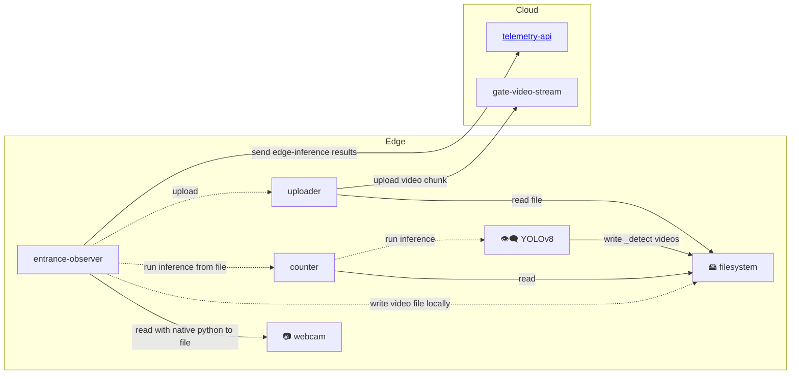

# gratheon / entrance-observer

Beehive entrance video processing client script.
Intended to be deployed on edge on NVidia Jetson Orin / Jetson Nano / Mac or similar GPU-capable machines.

https://github.com/user-attachments/assets/a3243245-34a8-4626-a990-f7e34b7b8ff6


## Features

- Video input stream. Best to use 4K USB camera. Streams data into memory and then store it on disk with as 10 sec chunks
	- Tries to autodetect camera if its not found
- Uploads video chunks to gratheon web-app for playback (assuming wifi/lan is present)
	- Uses H.264 codec for video compression (~2mb for 10 sec)
- Runs bee detection using YOLO ML model


Note. I Tried dual CSI cameras too, it could work too, but quality of optics was not sufficient (too much fish-eye)

## Running
```
python3 src/main.py
```

## Installation

```
git clone https://github.com/Gratheon/entrance-observer.git
cp .env.example .env
```
- Generate API token in https://app.gratheon.com/account
- Open your hive entrance view, ex https://app.gratheon.com/apiaries/55/hives/68/box/250 and use BOX_ID from the end of URL, ex. 250.
- Edit `.env` and configure values

### Configuration
We use env vars and we load them from `.env` file for ease of management.

|var|description|example|
|--|--|--|
|HIVE_ID|identifier of the hive. Can be found in the gratheon.com hive URL|364|
|SECTION_ID|hive section (box). Can be found in the URL|1944|
|API_TOKEN|authentication token| 9f23616a52-2a51-4369-96d3-237a456eedb5
|CAMERA_DEVICE|numerical number for the device|0
|FPS|frame rate of the camera|30|
|WIDTH_PX|width of the output video. |960|
|HEIGHT_PX|height of the video. will be ignored if it does not match aspect ratio of the camera, will get calculated based on WIDTH_PX |720|

## Development

### Unit tests

We use [`just`](https://github.com/casey/just) to run commands instead of `make`. Under the hood it relies on pytest. Unit tests check simple functions:

```
just test
```

### Integration tests
Integration tests rely on more complexity and side effects. It needs/checks
- cameras to be present
- GPU inference to works
- network request reaches gratheon telemetry endpoint
```
just test-integration
```


### Platform Support

The entrance-observer now supports multiple platforms:

- **Linux** (NVidia Jetson, Raspberry Pi, etc.) - Uses V4L2 backend with `/dev/video*` devices
- **macOS** - Uses AVFoundation backend with camera indices (0, 1, 2, etc.)
- **Windows** - Uses DirectShow backend


## Architecture

- We upload a 10 sec video chunks to gratheon web-app for playback feature
- We separate webcam from inference mostly because inference is dockerized while webcam uses local window for preview.

