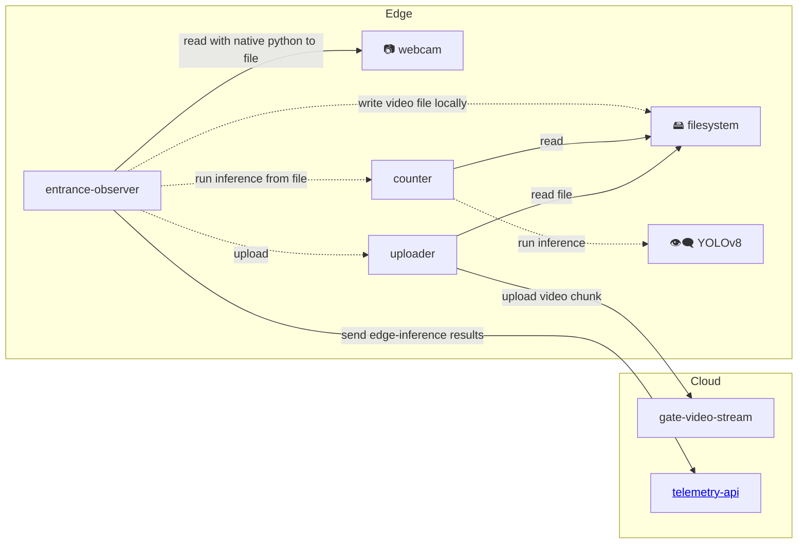

# gratheon / entrance-observer

Beehive entrance video processing client script.
Intended to be deployed on edge on NVidia Jetson Orin / Jetson Nano / Mac or similar GPU-capable machines.

https://github.com/user-attachments/assets/a3243245-34a8-4626-a990-f7e34b7b8ff6


## Features

- Video input stream. Best to use 4K USB camera. Streams data into memory and then store it on disk with as 10 sec chunks
- Uploads video chunks to gratheon web-app for playback (assuming wifi/lan is present)
- Runs bee detection using YOLO ML model


Note. I Tried dual CSI cameras too, it could work too, but quality of optics was not sufficient (too much fish-eye)

## Installation

```
git clone https://github.com/Gratheon/entrance-observer.git
```
- Generate API token in https://app.gratheon.com/account
- Open your hive entrance view, ex https://app.gratheon.com/apiaries/55/hives/68/box/250 and use BOX_ID from the end of URL, ex. 250.
- Rename `.env.example` to `.env` and fill in the required fields

### Configuration
We use env vars and we load them from `.env` file for ease of management.
Some of them:
```
API_TOKEN=...
HIVE_ID=...

# section is a box (vertical part of the hive), get the number from the URL
SECTION_ID=...
```

### Unit tests

We use [`just`](https://github.com/casey/just) to run commands instead of `make`. Under the hood it relies on pytest. Unit tests check simple functions:

```
just test
```

### Integration tests
Integration tests rely on more complexity and side effects. It needs/checks
- cameras to be present
- GPU inference to works
- network request reaches gratheon telemetry endpoint
```
just test-integration
```


### Platform Support

The entrance-observer now supports multiple platforms:

- **Linux** (NVidia Jetson, Raspberry Pi, etc.) - Uses V4L2 backend with `/dev/video*` devices
- **macOS** - Uses AVFoundation backend with camera indices (0, 1, 2, etc.)
- **Windows** - Uses DirectShow backend

### Camera Configuration

#### Automatic Detection
By default, the system will automatically detect and use available cameras:

```bash
python3 -m pip install -r requirements.txt
python3 main.py
```

#### Manual Camera Selection
You can specify a camera device manually by modifying the `startObserverClient()` call in `main.py`:

**Linux:**
```python
startObserverClient("/dev/video0")  # Use specific video device
```

**macOS:**
```python
startObserverClient("0")  # Use camera index 0 (built-in camera)
startObserverClient("1")  # Use camera index 1 (external camera)
```

#### Testing Camera Setup
Use the included test script to verify camera functionality:

```bash
python3 test_camera.py           # Test all available cameras
python3 test_camera.py 0         # Test specific camera (macOS/Windows)
python3 test_camera.py /dev/video0  # Test specific device (Linux)
```

## Architecture

- We upload a 10 sec video chunks to gratheon web-app for playback feature
- We separate webcam from inference mostly because inference is dockerized while webcam uses local window for preview.

