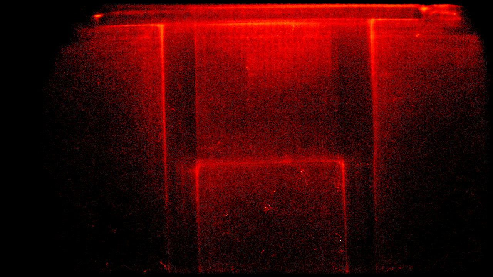

# gratheon / entrance-observer

Beehive entrance video processing client app.
Intended to be deployed on edge on NVidia Jetson Orin / Jetson Nano / Mac or similar GPU-capable machines.


https://github.com/user-attachments/assets/179273c2-4683-4879-bcb9-0aa2abe75953

https://github.com/user-attachments/assets/c298b395-58aa-4de6-8e91-35d7c27c9b87

## Features

- **Video capture**. Best to use 4K USB camera. Streams data into memory and then store it on disk with as 30 sec chunks (configureable)
  - Tries to autodetect camera if its not found
  - Runs calibration of camera bandwidth to ensure stable FPS in output videos as we cannot dynamically change FPS after video encoding has started.
    Tested with 1280x720 resolution @ 15FPS on USB2 using Jetson Orin Nano
- **Detects bees** using YOLO 11 model with custom bee detection weights.
- **Tracks bees movements and speeds** and estimates their movement speeds. Stores tracks for potential behavioural analysis
- **Counts incoming and outgoing bees**. Calculates net flow. Useful to estimate forager loss.

- **Video upload**. Uploads video chunks to [gratheon web-app](https://github.com/Gratheon/web-app/) for playback (assuming wifi/lan is present)
  - Uses H.264 codec for video compression if available (usually on mac)
    - Falls back to mp4 ifcodec is not available (jetson orin nano)
  - Skips video upload if no bees were incoming/outgoing to avoid unnecessary traffic

- **Web UI** for local network access and configuration (with streaming) with a simple log of:
  - detected bees
  - incoming/outgoing bees
  - max log is the past 10h
  - sleep at night time (22:00-06:00) to avoid loading the system and network when bees are not visible
  - stores settings in data/settings.json for persistance if you need to restart docker container or reload/re-visit WebUI
- **Telemetry** - metrics are sent to [gratheon web-app](https://github.com/Gratheon/web-app/) for aggregate statistics

## Metrics


The application collects a rich set of metrics to provide a comprehensive overview of the beehive's activity. These metrics are saved locally to `metrics.jsonl` and, if configured, sent to the Gratheon telemetry service.

### Core Metrics

- **`bees_in`**: The number of bees that crossed the virtual line to enter the hive.
- **`bees_out`**: The number of bees that crossed the virtual line to exit the hive.
- **`detected_bees`**: The total number of unique bees detected in the frame during the processing period.

### Derived Metrics

- **`net_flow`**: Calculated as `bees_in - bees_out`, this metric indicates the net change in the hive's population. A positive value suggests more bees are returning than leaving, while a negative value could be an early indicator of swarming or other issues.
- **`avg_speed_px_per_frame`**: The average speed of all tracked bees, measured in pixels per frame. This provides an insight into the general flight speed of the bees.
- **`p95_speed_px_per_frame`**: The 95th percentile of bee speed. This helps to understand the top speed of the fastest bees, filtering out potential outliers.
- **`stationary_bees_count`**: The number of bees that are considered stationary (i.e., their total movement is below a certain threshold). This can be useful for identifying guard bees or bees performing orientation flights.
- **`bee_interactions`**: The number of times bees come into close proximity with each other. This can be used to identify a variety of behaviors, including guarding, food exchange (trophallaxis), or simple collisions.

### Raw Track History

For in-depth analysis and potential model retraining, the application also saves the raw track history of each bee to a separate `track_history.jsonl` file. Each entry in this file contains:

- **`timestamp`**: The UTC timestamp of the recording.
- **`frame_dimensions`**: The height and width of the video frame, which is crucial for interpreting the coordinate data.
- **`track_history`**: A dictionary where each key is a unique bee ID and the value is a list of `[x, y]` integer coordinates representing the bee's path.

### Notes

- I Tried dual CSI cameras too, it could work too, but quality of optics was not sufficient (too much fish-eye)
- Note we are not _streaming_ video to gratheon.com as we do not adjust bandwidth/video quality depending on connectivity. So reliable network connection is essential. We are uploading chunks.

## Installation

- After manual installation of the entrance observer device, make sure to correctly position camera, so that hive entrance is **down**.
- Setup your edge devices to prepare the service

```
git clone https://github.com/Gratheon/entrance-observer.git
cd entrance-observer
cp example.env .env

# Optional: choose Python version via pyenv
# pyenv install -s 3.10.14
# pyenv local 3.10.14

python3 -m venv .venv
source .venv/bin/activate
python3 -m pip install --upgrade pip

# macOS
pip3 install -r requirements.macos.txt

# Jetson/Linux
# pip3 install -r requirements.jetson.txt
```

cp data/settings.example.json data/settings.json

# Optional Jetson-only image tweaks without changing tracked files
cp Dockerfile.local.example Dockerfile.local

- Generate API token in https://app.gratheon.com/account
- Open your hive entrance view, ex https://app.gratheon.com/apiaries/55/hives/68/box/250 and use BOX_ID from the end of URL, ex. 250.
- Edit `.env` and configure values (see Configuration section below)
- Run service (see Running section below)
- Open service web ui (see URL section below)

### Tuning

- Once service runs, make sure its detection speed is below `VIDEO_CHUNK_LENGTH_SEC` (30 sec) video segment. Otherwise you risk of having detection being slower than recording, thus crashing the service. Ex. in logs:

```
Time taken for countBeesAndReportTelemetry: 28.31 seconds
```

- Check wether videos are uploaded to the web-app and are accessible for playback there.

### Configuration

Most runtime settings are configured from the local web UI Settings page and persisted in `data/settings.json`. The repository tracks `data/settings.example.json` as the baseline template, while `data/settings.json` is intentionally local-only to avoid `git pull` conflicts on deployed devices. Env vars loaded from `.env` are still supported as fallback for deployment and hardware/video parameters.

Existing deployed devices can migrate safely with:

```bash
git pull
[ -f data/settings.json ] || cp data/settings.example.json data/settings.json
[ -f Dockerfile.local ] || cp Dockerfile.local.example Dockerfile.local
```

This keeps existing local `data/settings.json` untouched and only bootstraps missing local files after the pull.

| var                            | description                                                                                                                                                                                                                                                                                                     | example                                    |
| ------------------------------ | --------------------------------------------------------------------------------------------------------------------------------------------------------------------------------------------------------------------------------------------------------------------------------------------------------------- | ------------------------------------------ |
| HIVE_ID                        | Legacy fallback; prefer Settings page. Identifier of the hive. Can be found in the gratheon.com hive URL                                                                                                                                                                                                                                               | 364                                        |
| SECTION_ID                     | Legacy fallback; prefer Settings page. Hive section (box). Can be found in the URL                                                                                                                                                                                                                                                                     | 1944                                       |
| API_TOKEN                      | Legacy fallback; prefer Settings page. Authentication token                                                                                                                                                                                                                                                                                            | 9f23616a52-2a51-4369-96d3-237a456eedb5     |
| VIDEO_UPLOAD_URL               | Legacy fallback; prefer Settings page. GraphQL endpoint for uploading recorded videos and detections.                                                                                                                                                                                                                                                  | https://video.gratheon.com/graphql         |
| TELEMETRY_BASE_URL             | Legacy fallback; prefer Settings page. Base URL for telemetry ingestion endpoint.                                                                                                                                                                                                                                                                      | https://telemetry.gratheon.com             |
| TELEMETRY_UPLOAD_PATH          | Legacy fallback; prefer Settings page. Path appended to `TELEMETRY_BASE_URL` for movement uploads.                                                                                                                                                                                                                                                     | /entrance/v1/movement                      |
| TELEMETRY_UPLOAD_URL           | Legacy fallback; prefer Settings page. Optional full telemetry upload URL override. If set, takes precedence over base URL + path.                                                                                                                                                                                                                     | http://localhost:8080/entrance/v1/movement |
| TELEMETRY_DIR                  | Legacy fallback; prefer Settings > Storage. Directory for local metrics and track history JSONL files.                                                                                                                                                                                                                                                 | ./telemetry                                |
| TELEMETRY_RETENTION_DAYS       | Legacy fallback; prefer Settings > Storage. Number of days to keep local telemetry JSONL files.                                                                                                                                                                                                                                                        | 30                                         |
| RUNS_DIR                       | Legacy fallback; prefer Settings > Storage. Directory for temporary/debug artifacts produced by detection or training runs.                                                                                                                                                                                                                            | ./runs                                     |
| RUNS_RETENTION_DAYS            | Legacy fallback; prefer Settings > Storage. Number of days to keep processing run artifacts.                                                                                                                                                                                                                                                           | 7                                          |
| MIN_FREE_DISK_MB               | Legacy fallback; prefer Settings > Storage. Old managed files are deleted until this much disk is free.                                                                                                                                                                                                                                                | 1024                                       |
| MAX_MANAGED_STORAGE_MB         | Legacy fallback; prefer Settings > Storage. Maximum total size for managed videos, telemetry logs, and run artifacts. `0` means unlimited.                                                                                                                                                                                                             | 0                                          |
| CAMERA_DEVICE                  | numerical number for the device. For Linux, you can set it to `/dev/video0`.                                                                                                                                                                                                                                    | 0                                          |
| FPS                            | frame rate of the camera                                                                                                                                                                                                                                                                                        | 30                                         |
| WIDTH_PX                       | width of the output video.                                                                                                                                                                                                                                                                                      | 960                                        |
| HEIGHT_PX                      | height of the video. will be ignored if it does not match aspect ratio of the camera, will get calculated based on WIDTH_PX                                                                                                                                                                                     | 720                                        |
| CONFIDENCE                     | Legacy fallback; prefer Settings > Video Settings. Bee detection confidence threshold from 0 to 1. Detections below this value are hidden from the live detection preview and excluded from counting.                                                                                                       | 0.5                                        |
| DETECTION_LINE                 | coefficient for the vertical position of the counting line, from 0 to 1                                                                                                                                                                                                                                         | 0.5                                        |
| VIDEO_CHUNK_LENGTH_SEC         | length of the video chunks in seconds. Smaller values result in more files created. Higher values in larger video file size getting uploaded and higher probability of upload as some bee may get detected coming in/out. Higher values also give more room to increase resolution/fps for best performance fit | 60                                         |
| DAY_START_HOUR                 | Legacy fallback; prefer Settings page. The hour (0-23) when the service should start processing video. Set to DAY_END_HOUR to disable the sleep schedule.                                                                                                                                                                                              | 6                                          |
| DAY_END_HOUR                   | Legacy fallback; prefer Settings page. The hour (0-23) when the service should stop processing video and sleep. Set to DAY_START_HOUR to disable the sleep schedule.                                                                                                                                                                                   | 22                                         |
| VIDEO_RETENTION_MINUTES        | Legacy fallback; prefer Settings > Storage. The number of minutes to retain recorded videos before deleting them. Defaults to 1440 (24 hours).                                                                                                                                                                                                              | 1440                                       |
| DETECT_VIDEO_WIDTH             | Width of the preview video with bee detections. Smaller resolutions save storage space and network load. Note that this is not affecting model detection size, only video output                                                                                                                                | 320                                        |
| DETECT_VIDEO_HEIGHT            | Height of the preview video with bee detections.                                                                                                                                                                                                                                                                | 240                                        |
| DETECT_VIDEO_RETENTION_MINUTES | Legacy fallback; prefer Settings > Storage. The number of minutes to retain preview videos before deleting them. Defaults to 10 minutes.                                                                                                                                                                                                                    | 10                                         |


### Counting boundary modes

The local Web UI supports two counting boundary modes:

- `Line` - the existing horizontal red line. Bees are counted by crossing the line, and the hive entrance marker controls whether crossing downward or upward means incoming.
- `Rectangle` - a movable and resizable red rectangle. Place it over the hive entrance opening. A tracked bee is counted as incoming when its center enters the rectangle and outgoing when its center exits the rectangle.

The selected mode and rectangle geometry are stored in `data/settings.json` as `counting_mode` and `detection_rectangle`. Rectangle values are normalized coefficients from `0` to `1`, so they scale with the video frame size.
#### Listing cameras

To list which cameras correspond to which devices in linux, you can use:

```
sudo apt install v4l-utils
v4l2-ctl --list-devices
```

## Supported environments

Tested on these environments:
✅ Mac OSX
✅ Jetson Orin Nano - Ubuntu 22 - Python 3.10 - Jetpack 6 - cuDNN 8

## Running natively (Mac)

```
PYTHONPATH=. python3 src/main.py
```


If a specific Jetson needs local image customizations, create `Dockerfile.local` from `Dockerfile.local.example` and start compose with `DOCKERFILE_PATH=Dockerfile.local docker compose up --build`. `Dockerfile.local` is gitignored, so future pulls do not conflict with device-specific package changes.
### Running with Docker (Jetson Orin)

```bash
docker compose up --build
```

## URLs

| URL                   | Description                                                                         |
| --------------------- | ----------------------------------------------------------------------------------- |
| http://localhost:3030 | Entrance observer service web UI with local web cam stream, available after startup |

## Heatmap generation

After running entrance analysis for a day and getting telemetry and tracks information stored in telemetry folder, you can run landing board heatmap generation script to see which areas of the landing board are visited the most.

```
python heatmap_generator.py telemetry/track_history_2025-09-07.jsonl -o heatmap-09-07.png
```



## Development


The real-video regression test in `tests/counter_test.py` uses the currently shipped YOLO weights and a recorded clip. If the model or tracker behavior changes intentionally, update the regression snapshot only after confirming the new result is stable across repeated local runs.
### Unit tests

We use [`just`](https://github.com/casey/just) to run commands instead of `make`. Under the hood it relies on pytest. Unit tests check simple functions:

```bash
just test
# Equivalent direct command used in CI-style debugging:
PYTHONPATH=src .venv/bin/pytest tests -q
```

### Integration tests

Integration tests rely on more complexity and side effects. It needs/checks

- cameras to be present
- GPU inference to works
- network request reaches gratheon telemetry endpoint

```
just test-integration
```

### Platform Support

The entrance-observer now supports multiple platforms:

- **Linux** (NVidia Jetson, Raspberry Pi, etc.) - Uses V4L2 backend with `/dev/video*` devices
- **macOS** - Uses AVFoundation backend with camera indices (0, 1, 2, etc.)
- **Windows** - Uses DirectShow backend

## Architecture

The video processing pipeline is designed to be robust and efficient, handling both the capture of raw video frames and their subsequent encoding into a compressed format suitable for storage and analysis.

### Video Processing Workflow

The application uses OpenCV for both video capture and encoding. The `cv2.VideoCapture` function is used to interface with the camera hardware, and the `cv2.VideoWriter` function is used to encode the video. This approach was chosen for its simplicity and reliability across different platforms.

## License

This project is **dual-licensed**:

- **[AGPL v3](LICENSE-AGPL.md)** - For open source use:
  - ✅ You can use, modify, and distribute the software
  - ✅ Source code is freely available
  - ⚠️ If you modify and host a public instance, you must share your modifications
  - ⚠️ Any derivative work must also be licensed under AGPL v3

- **[Commercial License](LICENSE-COMMERCIAL.md)** - For enterprise customers who need:
  - 🏢 On-premise deployment without source disclosure
  - 🔧 Custom modifications without copyleft obligations
  - 🎨 White-label/rebranding rights
  - 📞 Priority support and SLA guarantees

### Contributing

If you'd like to contribute, please see our [Contributing Guide](CONTRIBUTING.md) and sign our Contributor License Agreement (CLA).

- Please refer to the `CODEOWNERS` file for ownership details.
- Code style is enforced by Prettier (`npm run prettier`).
- Follow standard GitHub flow: Fork the repository, create a feature branch, make changes, and submit a Pull Request.
