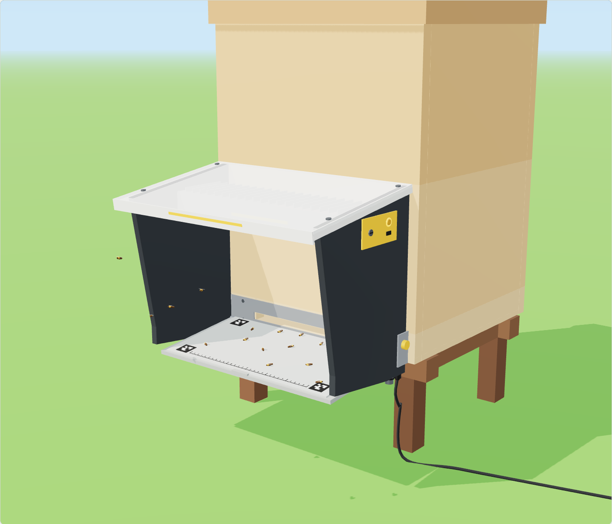
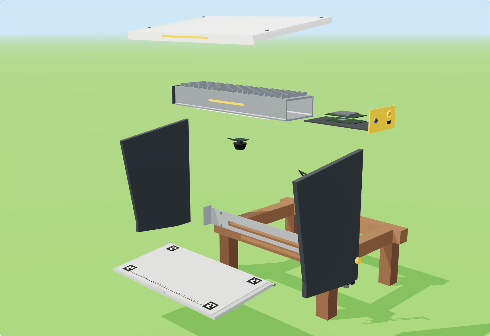
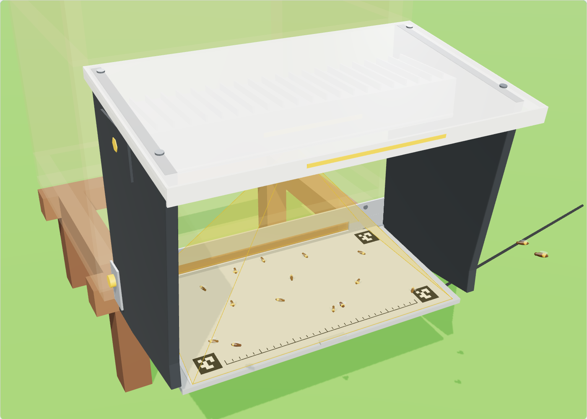
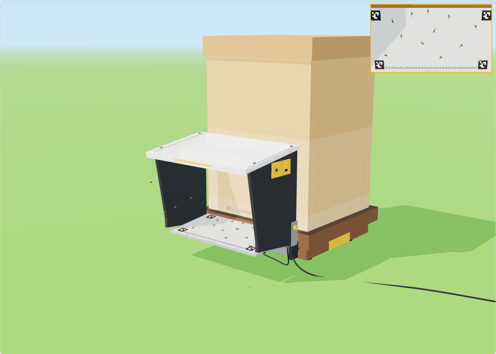
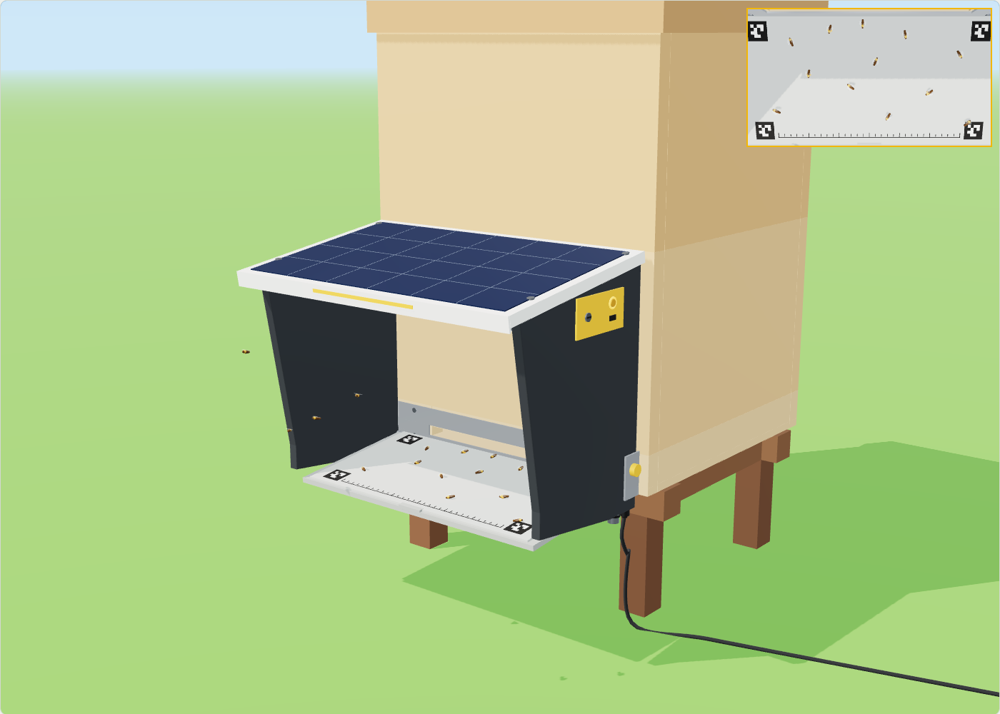

# Entrance Observer — Phase 3 device design

Concept design of the production Entrance Observer: a camera arch that hangs on a hive entrance. It is a design proposal to review, not a frozen spec. The energy and cost figures are estimates until the Phase 2 units are measured.

- **3D model:** open [`3d-model/index.html`](../3d-model/index.html) (self-contained, works offline) or see [gratheon.com/products/entrance_observer](https://gratheon.com/products/entrance_observer/). [`3d-model/entrance-observer.glb`](../3d-model/entrance-observer.glb) contains the exploded-view animation.
- **Source:** `3d-model/observer-model.js` holds every dimension. The viewer shares its code and scene with the [beehive scale](https://github.com/Gratheon/beehive-sensors/tree/main/model) and [Robotic Beehive](https://github.com/Gratheon/robotic-beehive/tree/main/model) models and uses the same axes, so the three can be placed together.

## What the device is

| | |
| --- | --- |
| **Form** | An arch over the landing board: two side cheeks, a head across the top, an opal canopy over the head, and a hinged landing board between the cheeks. The entrance itself stays open. |
| **Size** | 486 × 360 × 300 mm (w × h × d), about 2.5 kg |
| **Camera** | 8 MP (3840 × 2160) Sony STARVIS 2 sensor, locked-focus M12 lens, 80° wide, looking straight down from 220 mm |
| **Board in view** | ≈ 370–400 × 220 mm at ≈ 10.4 px/mm: a worker bee is ≈ 135 px long and a varroa mite ≈ 15 px |
| **Compute** | Swappable sled: Raspberry Pi 5 (8 GB), Hailo-8 (26 TOPS) and 256 GB NVMe for now; a Jetson Orin NX or a later accelerator uses the same bay |
| **Supervisor** | Always-on ESP32-S3 board (the beehive-scale carrier design) that switches the computer on only when bees can fly |
| **Power** | PoE+ (802.3at), 12–24 V DC, or the solar version (20 W canopy panel + 77 Wh LiFePO4) |
| **Links** | Ethernet (PoE), Wi-Fi, BLE for setup, M12 accessory port for the beehive scale |
| **Mounting** | An entrance plate held by 4 wood screws. The arch hangs on it and locks with 2 thumbscrews. The same arch fits the beehive scale (on risers) and the Robotic Beehive (on its entrance frame). |
| **Target BOM** | ≈ €350–450 at 100 units (Pi 5 + Hailo sled). ApicAI sells at €350–550. |

## Design decisions

### 1. The camera looks straight down, from a fixed place

The prototypes used a varifocal 4K camera on a wall bracket above the entrance. Each installation had a different angle and distance, so bee size, speed and the counting line changed from hive to hive, and the camera was sometimes knocked out of alignment.

- **Top-down, 220 mm above the board.** Bees are seen in true proportions and the same number of pixels per millimetre everywhere. Pose keypoints, body length, pollen loads and mites are then measurable, not just detectable. The field of view slightly overlaps the entrance edge, so bees are tracked right up to the point where they go in.
- **Locked optics.** A fixed M12 lens and a fixed working distance: every unit produces the same image, and models trained on one unit work on all of them.
- **The camera is a module.** The sensor board connects over MIPI CSI with its own flex cable. A global-shutter sensor, which pose analysis of fast wing and leg motion may need, can replace it without changing the housing.
- **Calibration markers on the board.** Four ArUco markers and a millimetre scale are in every frame. The software computes mm/px exactly, straightens the view, and raises an alert if the Observer has been knocked.

4K stays. A cheaper low-resolution SKU would lose mites and pose, the data quality the product is built for. If a budget version is needed, it should be the same arch with a smaller compute sled, not a worse camera.

### 2. Light, glare and rain

The canopy does most of the optical work.

- **Opal canopy.** 5 mm opal (light-diffusing), UV-stabilised polycarbonate. It turns direct sun into even light, like a photographer's softbox. The sun no longer throws hard bee shadows, bright patches or glare on the board. These are the main causes of false detections and broken tracks at the entrance. It overhangs the board by 80 mm, slopes 8° forward and has drip edges, so rain drips off in front of the board, outside the view.
- **Graphite cheeks.** They block low side sun and wind, and give a dark, even surround so the exposure is set by the board alone.
- **Matt light-grey board (≈ N7).** It is the background of every frame, so it is designed as part of the product. White overexposes in the sun and hides pale pollen loads. Wood grain and dirt confuse detectors. The top 3 mm insert slides out for washing.
- **Downward-facing window.** The lens window is at the tip of a matt black hood and faces the ground. Rain cannot reach it, the sky cannot reflect in it, and the canopy keeps the sun off it. A 0.3 W heater film clears dew on cold mornings.
- **Light bars, rarely used.** Two diffused LED bars have crossed polarisers on the LEDs and the lens to remove glints from shiny bees and wet pollen. They only flash in sync with the exposure, at dusk or in deep shade.

### 3. Wires: none in the sun, none in view

- All cables enter from below, under the right cheek, facing the ground: a PoE cable gland and an M12 accessory socket. Water runs off them, not into them, and the cable leaves with a drip loop.
- The right cheek is a hollow box section. The harness runs up inside it to the head.
- The field of view ends 25 mm inside the cheeks' inner faces. The cheeks, head, canopy and cables are never in the video. The viewer's *Show what the camera sees* inset renders exactly what the lens sees.

### 4. Installation, service, manufacturing

- **Install once, hang in seconds.** The aluminium entrance plate is screwed to the bottom board with 4 stainless screws on either side of the entrance, using a paper drill template. Its window matches the 300 × 15 mm entrance. The arch hangs on the plate's two bent ears and locks with two captive thumbscrews. It comes off for an inspection, a hive move or winter in seconds, and goes back to exactly the same place.
- **Service side is +X**, the same as the scale pod. The compute sled slides out of the right cheek after a quarter-turn. It has a status ring, a setup button and a USB-C port for copying full-resolution research clips on site.
- **Parts any workshop can make.** Laser-cut and folded aluminium cheeks and plate, an aluminium extrusion for the head (it is also the heatsink), a cut and cold-bent polycarbonate canopy, and a CNC-routed HDPE board. Small parts (sled, risers, end caps) are 3D-printed ASA for pilot batches.
- **Flat-pack.** The arch ships as flat parts plus the head, in a box of about 500 × 350 × 130 mm. Assembly needs 8 captive screws and a screwdriver. The board folds up on its hinge.
- **No fan.** The head is the heatsink. Its fins sit in the ventilated gap under the canopy, and hot air leaves through the slot at the back of the canopy.

### 5. Works alone, works better together

The arch is identical in all three setups. Only what it hangs on changes.

| Setup | Mount | Power | Data |
| --- | --- | --- | --- |
| **Alone on a hive** | Entrance plate, 4 screws | PoE+ from a switch or injector (up to 100 m), 12–24 V DC, or the solar canopy | Ethernet or Wi-Fi |
| **With the beehive scale** | Two printed risers hook onto the scale's front rail. The arch hangs on the scale base, not the hive, so its weight, bees on the board and snow on the canopy are never weighed. | The Observer powers the scale pod over the M12 lead (5 V), so the scale needs no solar board | The scale sends weight and temperatures over UART; the Observer uploads both and syncs the time |
| **On the Robotic Beehive** | The robot's entrance tunnels end in the same ears | From the robot PoE switch, cable inside a corner post | The robot uses entrance activity to choose when to inspect. Heavy models (pose) can run on the robot's Jetson. |

The M12 accessory port has the same pinout as the scale's front connector: 5 V out, ground, 1-Wire, UART, wake, shield.

Interface requirement for the Robotic Beehive: the tunnel mouth must fit inside the arch (≤ 420 mm wide at the front, currently 480 mm).

## Energy

The computer is the only large consumer. It runs only when bees can fly, and the always-on supervisor decides when that is.

| State | Draw | When |
| --- | --- | --- |
| Asleep | ≈ 0.12 W (supervisor, sensors, idle regulators) | Night, rain, below ≈ 10 °C, winter |
| Observing | ≈ 9 W (Pi 5 + Hailo-8 + 4K camera + Ethernet) | Flight weather, daylight |
| Booting | ≈ 5 W for ≈ 25 s | Before each observation in sampled mode |

The prototype Jetson Orin Nano measured 6.9 W at 720p. The 9 W figure assumes 4K capture and is an estimate until the Pi 5 + Hailo sled is measured.

| Mode | Energy per flight day (12 h) | Use |
| --- | --- | --- |
| Continuous | ≈ 111 Wh | PoE / mains: counts, tracks and clips all day |
| Sampled (2 of every 10 min) | ≈ 27 Wh | Solar: traffic curve with 20 % coverage, clips on anomalies |
| Asleep all day | ≈ 3 Wh | Rain, cold, winter |

**Solar version.** The canopy is a 20 W ETFE panel. From May to August in Estonia it yields about 60 Wh/day (≈ 4.5 sun-hours on a near-horizontal panel, 70 % system efficiency), which covers the sampled mode with margin. It runs continuous observation on the best days when the battery is above 80 %. Energy demand follows the weather: bees fly when it is sunny and warm, which is when the panel produces. On rainy or cold days the Observer stays asleep at ≈ 3 Wh/day, so the 77 Wh LiFePO4 battery lasts about 3 weeks without sun. Flight weather without sun (warm and overcast) is the worst case: about 2.5 days of sampled observation from a full battery.

**PoE is the default** because it solves power and the unreliable apiary Wi-Fi seen in the field test with one outdoor cable. Pose models and 60 FPS research capture need continuous power anyway.

## Competition

| | ApicAI (DE) | Beemate (AU) | Purple Hive (AU) | Gratheon Entrance Observer |
| --- | --- | --- | --- | --- |
| Focus | Pollination, counts | Counts, live stream | Varroa only | Counts, tracks, pollen, varroa, pose |
| Camera | Jetson at the entrance | HD | 2 cameras, 1 photo/s | 4K top-down, locked optics, calibrated board |
| Power | Mains / solar | Mains | Solar, 4G | PoE, or solar canopy |
| Integration | Scale + sensors | — | — | Beehive scale (power + data), Robotic Beehive |
| Openness | Closed | Closed | Closed | Open source hardware and software |

## Open questions

- Measure Pi 5 + Hailo-8 with 4K capture, tracking and encoding at the same time: watts, FPS, thermal behaviour in the head at 35 °C ambient.
- Test bee acceptance of a 300 mm-deep arch over the landing board, and whether bees beard on the canopy underside in hot weather (bearding detection could be a feature).
- Global vs rolling shutter for pose: compare the two camera modules side by side on the same arch.
- Canopy material: opal twin-wall vs solid opal sheet (stiffness, snow load, light transmission).
- Whether the board needs a clip-on entrance reducer (hornets, robbing).
