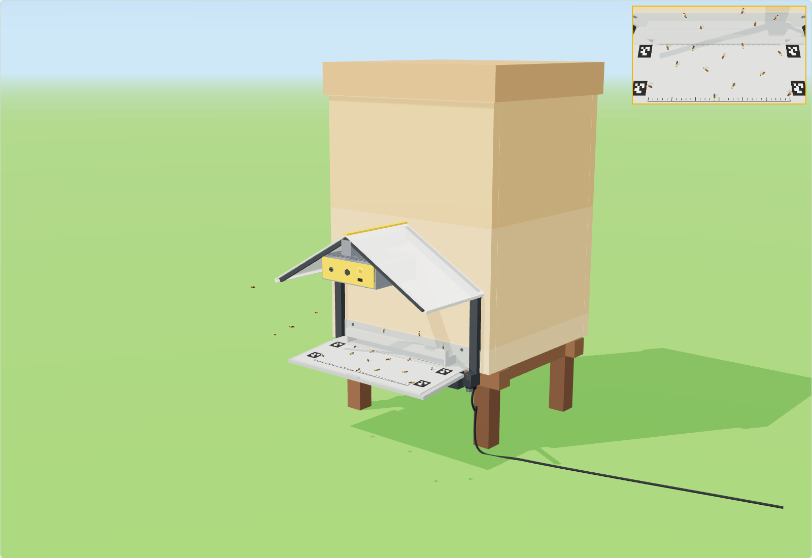
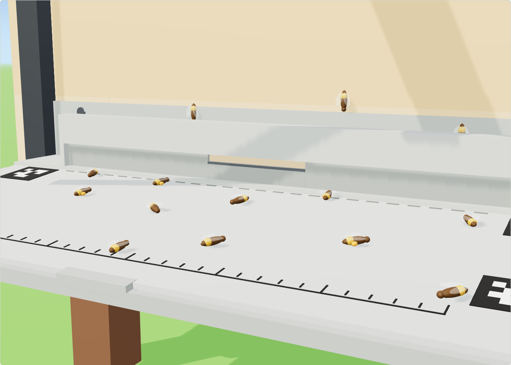

# Entrance Observer — Phase 3 device design

Concept design of the production Entrance Observer: a camera under a small steep roof over the hive entrance, with a porch that moves the doorway onto the landing board and an automatic gate in the porch mouth. It is a design proposal to review, not a frozen spec. The energy and cost figures are estimates until the Phase 2 units are measured.

- **3D model:** open [`3d-model/index.html`](../3d-model/index.html) (self-contained, works offline) or see [gratheon.com/products/entrance_observer](https://gratheon.com/products/entrance_observer/). [`3d-model/entrance-observer.glb`](../3d-model/entrance-observer.glb) contains the exploded-view animation. The viewer moves the gate between its four positions.
- **Source:** `3d-model/observer-model.js` holds every dimension. The viewer shares its code and scene with the [beehive scale](https://github.com/Gratheon/beehive-sensors/tree/main/model) and [Robotic Beehive](https://github.com/Gratheon/robotic-beehive/tree/main/model) models and uses the same axes, so the three can be placed together.

## What the device is

| | |
| --- | --- |
| **Form** | Two assemblies. The **entrance module** stays on the hive: a wall frame shaped like a house gable, the porch with the automatic gate, and the landing board. The **head** hangs on the apex of the frame: ridge beam, steep gable roof and the camera + compute pod. |
| **Size** | ≈ 476 × 375 × 215 mm (w × h × d), ≈ 3 kg (entrance module ≈ 1.8 kg, head ≈ 1.2 kg) |
| **Camera** | 8 MP (3840 × 2160) Sony STARVIS 2 sensor, locked-focus low-distortion M12 lens, 90° wide, 186 mm above the board and tilted 16° back toward the hive |
| **In view** | The bottom ≈ 38 mm of the hive wall, the porch with the gate and the landing board up to ≈ 20 mm from its front edge, ≈ 400 mm across. ≈ 9.6 px/mm on the board: a worker bee is ≈ 125 px long and a varroa mite ≈ 14 px |
| **Counting line** | The porch mouth, 46 mm in front of the hive: every bee in or out crosses it in view |
| **Entrance gate** | Motorised, four positions: open · reduced (70 × 17 mm) · hornet guard (70 × 5.5 mm) · closed. Fails open. |
| **Compute** | Swappable sled: Raspberry Pi 5 (8 GB), Hailo-8 (26 TOPS) and 256 GB NVMe for now; a Jetson Orin NX or a later accelerator uses the same bay |
| **Supervisor** | Always-on ESP32-S3 board (the beehive-scale carrier design): switches the computer on only when bees can fly, and drives the gate |
| **Power** | PoE+ (802.3at), 12–24 V DC, or the solar version (14 W on the roof + 77 Wh LiFePO4) |
| **Links** | Ethernet (PoE), Wi-Fi, BLE for setup, M12 accessory port for the beehive scale |
| **Metal** | One machined part: the 170 × 140 mm pod. The frame is one laser-cut folded sheet; the beam is a standard extrusion. |
| **Target BOM** | ≈ €350–450 at 100 units (Pi 5 + Hailo sled, gate drive included). ApicAI sells at €350–550. |

## Design decisions

### 1. The camera looks down from a fixed place

The prototypes used a varifocal 4K camera on a wall bracket above the entrance. Each installation had a different angle and distance, so bee size, speed and the counting line changed from hive to hive, and the camera was sometimes knocked out of alignment.

- **186 mm above the board, tilted 16° toward the hive.** A 90° low-distortion lens keeps the device low, and the calibration markers correct what distortion is left. The tilt adds the porch and the bottom of the hive wall to the view (see [section 2](#2-flight-and-landing-where-to-count)). On the board the view is still close to top-down, so pose keypoints, body length, pollen loads and mites are measurable, not just detectable. A fixed tilt beats a pivoting camera: no motor outdoors, and no calibration that drifts.
- **Locked optics.** A fixed M12 lens and a fixed working distance: every unit produces the same image, and models trained on one unit work on all of them.
- **The camera is a module.** The sensor board connects over MIPI CSI with its own flex cable. A global-shutter sensor, which pose analysis of fast wing and leg motion may need, can replace it without changing the pod.
- **Calibration markers on the board.** Four ArUco markers and a millimetre scale are in every frame. The software computes mm/px exactly, straightens the view, and raises an alert if the head has been knocked.

4K stays. A cheaper low-resolution SKU would lose mites and pose, the data quality the product is built for. If a budget version is needed, it should be the same device with a smaller compute sled, not a worse camera.

### 2. Flight and landing: where to count

Bees do not all land on the landing board. Some land on the hive wall and walk down into the entrance, especially at peak traffic, in wind, or when the board is small or steep. A camera that only sees the board would miss them, or see them appear at the entrance edge with no clear direction.

What matters is not where bees land but that every bee crosses one line the camera sees. So the design moves that line:

- **A porch moves the doorway onto the board.** A 46 mm deep, 17 mm high tunnel across the full 300 mm entrance, in the same matt grey as the board. A bee on the wall has to walk down onto the porch roof and step off in front of the mouth to get in. Every bee in or out crosses the porch mouth, in full view, and the mouth is the counting line.
- **The camera also sees the wall.** The 16° tilt adds the porch roof and the bottom ≈ 38 mm of the wall to the view. Bees that land on the wall are tracked from the moment they land, and the share of bees that land there is measured, not guessed.
- **Counting rule.** A track that ends inside the porch is *in*, a track that starts there is *out*, wherever it came from. Tracks that stay ambiguous are reported separately with a confidence value, not dropped (the telemetry already has `unknownDirection`).
- **Nothing to clean, nothing to light.** The porch is short and open-air, with no glass. Guard bees tend to like a defined doorway.
- **Colours in view are chosen for detection.** Porch, gate, apron and entrance plate are matt grey. Nothing yellow or brown is in the view, so nothing looks like a bee, and no bare metal throws glare.

Rejected alternatives: an enclosed glass tunnel with the camera behind the glass (propolis, dust and condensation on the glass, constant lighting, congestion at peak traffic, and the open view that pollen, guard and pose data depend on is lost), a pivoting camera (a motor outdoors and a calibration that drifts), and discouraging wall landings (the porch makes them harmless for counting, so the bees keep their natural flight).

### 3. The automatic entrance gate

Beekeepers use entrance reducers all year: narrow against wind, cold and robbing, a hornet guard in late summer, closed for moving a hive. The porch mouth is the natural place for one, and the Observer is the first device that can move it at the right moment.

**Mechanism.** A 2 mm plate rises out of a slit in the porch floor, right at the mouth. It has a 70 mm notch in its centre, as deep as the porch is high, so a single travel gives four openings:

| Position | Gate top | Opening | Used for |
| --- | --- | --- | --- |
| Open | flush with the floor | full 312 × 17 mm | normal |
| Reduced | at the porch roof | 70 × 17 mm centre notch | wind, cold, robbing, beekeeper setting |
| Hornet guard | 11.5 mm above the notch | 70 × 5.5 mm slot: bees pass, hornets and wasps cannot | hornet at the entrance |
| Closed | notch at the porch roof | none | moving the hive, spraying nearby |

- When open, the gate is hidden under the floor: nothing in the view, nothing for bees to walk around.
- The drive sits in a sealed box under the porch floor, outside the view: a micro geared stepper with a self-locking lead screw, a hall sensor for the home position and a supercapacitor. The screw holds any position without power, so neither bees nor hornets can push the gate.
- **Fails open.** If power is lost, the supercapacitor drives the gate open. Every narrowing is a lease with a timer, renewed only while its reason lasts; the supervisor opens the gate when a lease runs out.
- **Cannot crush bees.** The gate rises slowly (≈ 7 mm/s) with a soft silicone edge and a motor current limit, and only when the camera sees no bee in the mouth. If it stalls, it goes back down.
- A move takes about 5 s at 1 W: negligible energy.

**Who moves the gate.** Decisions are made where the information is, and safety decisions never wait for a server:

| Trigger | Decided on | Position | Latency | Notes |
| --- | --- | --- | --- | --- |
| Hornet at the entrance (camera, confirmed by the hornet buzz on the microphone) | The Observer (compute) | Hornet guard | seconds | No network needed. Lifted 15 min after the last hornet. |
| Robbing (fights, erratic tracks, traffic spike) | The Observer (compute) | Reduced | minutes | Lifted when traffic is normal again |
| Cold night | Supervisor (ESP32), own temperature sensor | Reduced | — | Works while the computer is off |
| Strong wind or cold forecast | Web app, from the weather service | Reduced | minutes | Sent over the existing live-command channel; the device keeps the last command if the link drops |
| Beekeeper setting (per hive, schedule) | Web app | Any | minutes | Future hive "entrance" setting in the web app |
| Moving the hive, spraying | Beekeeper, in the web app or with the button | Closed | — | Always with a timer and an over-temperature release |
| Power loss, lease expired | Supervisor / supercapacitor | Open | — | Fail-safe |

Local safety (hornet, robbing, fail-open) overrides remote commands. A beekeeper setting sets the resting position that the gate returns to.

For a hornet, the design uses the hornet guard, not full closure. Closing the entrance leaves the foragers outside, where hornets hunt them, and a closed colony in late summer overheats. The guard keeps hornets out and lets bees home. Full closure is only for the beekeeper to choose, and always with a timer.

### 4. Roof, rain and snow

- **Steep gable, from the hive wall forward.** One 3 mm opal (light-diffusing) UV-stabilised polycarbonate sheet, bent once along the ridge into a 30° gable, 476 × 212 mm. It starts at the hive wall, so no rain gets in behind it. At 30° rain and snow slide off, and a flat roof would hold snow.
- **Drips land beside the board.** The ridge runs front to back, so water and snow go to the two side eaves, which overhang the landing board edges. Nothing drips onto the board in front of the camera.
- **Why not a cone.** A cone or hipped roof would also shed snow, but a front slope would drip onto the board, and a double-curved part needs a mould. A sheet bent once is cut and bent in any workshop.
- **Light.** Opal keeps the roof's shadow on the board soft, so it does not cut bees in half in the image. The camera meters on the grey board between the markers, with a short shutter time so bees in flight stay sharp.
- **Downward-facing window.** The lens window is at the tip of a matt black hood and faces the ground. Rain cannot reach it, the sky cannot reflect in it, and the roof keeps the sun off it. A 0.3 W heater film clears dew on cold mornings.
- **Light bars, rarely used.** Two short diffused LED bars with crossed polarisers on the LEDs and the lens remove glints from shiny bees and wet pollen. They only flash in sync with the exposure, at dusk or in deep shade.

### 5. Structure: one metal part

The earlier arch had a full-width aluminium head and two side boards. They were expensive and bulky, and the side boards blocked bees flying in from the sides. The structure is now:

- **Wall frame.** One laser-cut sheet of powder-coated steel or aluminium, folded into box sections, in the shape of a house gable: entrance plate, two slim uprights and two rafters. It is screwed to the bottom board with four stainless screws and leans on the hive body through two rubber pads, never screwed to it, so the bodies still lift off. It carries the porch, the gate and the board. It is flat, so it ships flat.
- **Ridge beam.** A standard 30 × 36 mm aluminium extrusion that hooks into the apex of the frame, locked by one captive thumbscrew. It carries the roof, two thin front rafters (for snow on the front corners) and the pod. The whole head lifts off in seconds and lands in the same place.
- **Pod.** The only machined metal: a 170 × 140 mm piece of finned aluminium extrusion, IP65, with printed end caps. It holds the camera module, the compute sled (slides out of the front, with the honey-yellow service face), the supervisor board and, in the solar version, the battery sled (slides out of the side). The pod is the heatsink: its fins sit in the ventilated space under the roof. No fan.
- **Sides are open.** Only the two slim uprights stand beside the board, against the hive wall, so bees can fly in from the front and the sides.

### 6. Wires: none in the sun, none in view

- All cables enter from below, under the foot of the right upright, facing the ground: a PoE cable gland and an M12 accessory socket. Water runs off them, not into them, and the cable leaves with a drip loop.
- The right upright is a closed box section. The harness runs up inside it, over the rafter and along the ridge beam to the pod. The gate drive plugs into the foot of the same upright.
- The porch floor widens into a grey apron up to the uprights, so the camera never sees the ground beside the porch. The frame, roof, pod and cables stay outside the view. The viewer's *Show what the camera sees* inset renders exactly what the lens sees.

### 7. Installation, service, manufacturing

- **Install once.** Screw the wall frame to the bottom board (4 screws, paper drill template), hang the head on the apex, and turn one thumbscrew. The entrance module stays on the hive all year and works as an automatic reducer even while the head is away.
- **Service.** The compute sled slides out of the front of the pod after a quarter-turn: status ring, setup button, USB-C for copying full-resolution research clips on site. The board insert slides out for washing.
- **Parts any workshop can make.** One laser-cut folded sheet (frame), one standard extrusion cut to length (beam), one finned extrusion (pod), a cut and bent polycarbonate sheet (roof), a CNC-routed HDPE board and porch, and 3D-printed ASA small parts for pilot batches.
- **Flat-pack.** Frame, roof and board ship flat with the pod: a box of about 500 × 400 × 110 mm.

### 8. Works alone, works better together

The entrance module and head are the same in all three setups. Only what the frame stands on changes.

| Setup | Mount | Power | Data |
| --- | --- | --- | --- |
| **Alone on a hive** | Wall frame, 4 screws to the bottom board | PoE+ from a switch or injector (up to 100 m), 12–24 V DC, or the solar roof | Ethernet or Wi-Fi |
| **With the beehive scale** | The frame stands on two printed risers hooked onto the scale's front rail, 2 mm clear of the hive; the porch bridges the gap over the deck with a brush seal. Frame, roof, snow and bees on the board are carried by the scale base and never weighed. | The Observer powers the scale pod over the M12 lead (5 V), so the scale needs no solar board | The scale sends weight and temperatures over UART; the Observer uploads both and syncs the time. A falling weight plus robbing traffic is a stronger robbing signal for the gate. |
| **On the Robotic Beehive** | The frame is bolted to the cabinet front, where the entrance tunnel ends | From the robot PoE switch, cable inside a corner post | The robot uses entrance activity to choose when to inspect, and closes the gate while a box is open. Heavy models (pose) can run on the robot's Jetson. |

The M12 accessory port has the same pinout as the scale's front connector: 5 V out, ground, 1-Wire, UART, wake, shield.

Interface requirement for the Robotic Beehive: the entrance tunnel must end in the Observer porch (≤ 312 mm wide at the front, currently 480 mm).

## Energy

The computer is the only large consumer. It runs only when bees can fly, and the always-on supervisor decides when that is.

| State | Draw | When |
| --- | --- | --- |
| Asleep | ≈ 0.12 W (supervisor, sensors, idle regulators) | Night, rain, below ≈ 10 °C, winter |
| Observing | ≈ 9 W (Pi 5 + Hailo-8 + 4K camera + Ethernet) | Flight weather, daylight |
| Booting | ≈ 5 W for ≈ 25 s | Before each observation in sampled mode |
| Moving the gate | ≈ 1 W for ≈ 5 s | A few times a day at most |

The prototype Jetson Orin Nano measured 6.9 W at 720p. The 9 W figure assumes 4K capture and is an estimate until the Pi 5 + Hailo sled is measured.

| Mode | Energy per flight day (12 h) | Use |
| --- | --- | --- |
| Continuous | ≈ 111 Wh | PoE / mains: counts, tracks and clips all day |
| Sampled (2 of every 10 min) | ≈ 27 Wh | Solar: traffic curve with 20 % coverage, clips on anomalies |
| Asleep all day | ≈ 3 Wh | Rain, cold, winter |

**Solar version.** A 7 W ETFE panel is laminated on each roof slope (14 W). From May to August in Estonia they yield about 44 Wh/day (≈ 4.5 sun-hours, 70 % system efficiency), which covers the sampled mode with margin. Whichever way the hive faces, one slope catches the morning or afternoon sun. Energy demand follows the weather: bees fly when it is sunny and warm, which is when the panels produce. On rainy or cold days the Observer stays asleep at ≈ 3 Wh/day, so the 77 Wh LiFePO4 battery lasts about 3 weeks without sun. Flight weather without sun (warm and overcast) is the worst case: about 2.5 days of sampled observation from a full battery. The gate keeps working on the supervisor alone even when the battery is too low for the camera.

**PoE is the default** because it solves power and the unreliable apiary Wi-Fi seen in the field test with one outdoor cable. Pose models and 60 FPS research capture need continuous power anyway.

## Competition

| | ApicAI (DE) | Beemate (AU) | Purple Hive (AU) | Gratheon Entrance Observer |
| --- | --- | --- | --- | --- |
| Focus | Pollination, counts | Counts, live stream | Varroa only | Counts, tracks, pollen, varroa, pose |
| Camera | Jetson at the entrance | HD | 2 cameras, 1 photo/s | 4K over wall, porch and board, locked optics, calibrated board, porch as counting line |
| Acts on what it sees | — | — | SMS alerts | Automatic gate: hornet guard, reducer, fail-open |
| Power | Mains / solar | Mains | Solar, 4G | PoE, or solar roof |
| Integration | Scale + sensors | — | — | Beehive scale (power + data), Robotic Beehive |
| Openness | Closed | Closed | Closed | Open source hardware and software |

## Open questions

- Measure the porch's cost to the bees: run two hives side by side on beehive scales, one with the porch and one without, and compare daily weight gain and forager traffic.
- Measure how many bees land on the wall at all, from the wall strip in view, over a season and at different traffic levels.
- Label clips by hand, with and without the porch, and compare against the automatic in/out counts.
- Gate: confirm the 5.5 mm slot against local hornet species (Vespa velutina, Vespa crabro) and drones; test whether one 70 mm opening is enough for autumn traffic under hornet pressure, or whether the notch should be wider or split in two.
- Gate: debris and propolis in the floor slit over a season, and whether the slit needs a brush seal.
- Measure Pi 5 + Hailo-8 with 4K capture, tracking and encoding at the same time: watts, FPS, thermal behaviour in the pod at 35 °C ambient.
- Check the wall frame against hive bodies with front hand cleats: the uprights may need standoffs.
- Snow load on the roof front corners with only the ridge beam and front rafters; test at 30° vs 35°.
- Global vs rolling shutter for pose: compare the two camera modules side by side on the same head.
