# Entrance Observer — Phase 3 device design

Concept design of the production Entrance Observer: a camera under a small steep roof over the hive entrance, with a porch that moves the doorway onto the landing board and an automatic gate in the porch mouth. It is a design proposal to review, not a frozen spec. The energy and cost figures are estimates until the Phase 2 units are measured.

[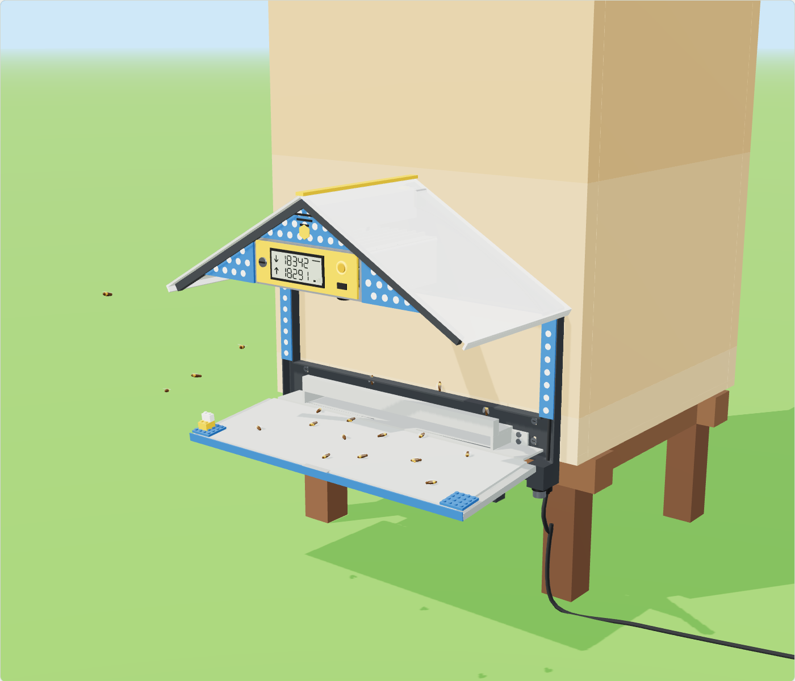](https://gratheon.com/products/entrance_observer/)

- **3D model:** open [`3d-model/index.html`](../3d-model/index.html) (self-contained, works offline) or see [gratheon.com/products/entrance_observer](https://gratheon.com/products/entrance_observer/). [`3d-model/entrance-observer.glb`](../3d-model/entrance-observer.glb) contains the exploded-view animation. The viewer moves the gate between its four positions (*Watch the gate work* runs it with the drive housing see-through), and the GLB has a second animation clip, `gate`.
- **Design principles:** the Observer follows the [hardware design principles](https://gratheon.com/docs/hardware-design-principles/) shared by all Gratheon hardware: wood first, aluminium where it must be strong, plastic only where nothing else works, one tool to install, every part replaceable, bees first.
- **Source:** `3d-model/observer-model.js` holds every dimension. The viewer shares its code and scene with the [beehive scale](https://github.com/Gratheon/beehive-sensors/tree/main/model) and [Robotic Beehive](https://github.com/Gratheon/robotic-beehive/tree/main/model) models and uses the same axes, so the three can be placed together.

## What the device is

| | |
| --- | --- |
| **Form** | Two assemblies. The **entrance module** stays on the hive: a wall frame shaped like a house gable, the porch with the automatic gate, and the landing board. The **head** hangs on the apex of the frame: ridge beam, steep gable roof and the camera + compute pod. |
| **Size** | ≈ 476 × 375 × 215 mm (w × h × d), ≈ 3 kg (entrance module ≈ 1.8 kg, head ≈ 1.2 kg) |
| **Camera** | 8 MP (3840 × 2160) Sony STARVIS 2 sensor, locked-focus low-distortion M12 lens, 90° wide, 186 mm above the board and tilted 16° back toward the hive |
| **In view** | The bottom ≈ 38 mm of the hive wall, the porch with the gate and the landing board up to ≈ 20 mm from its front edge, ≈ 400 mm across. ≈ 9.6 px/mm on the board: a worker bee is ≈ 125 px long and a varroa mite ≈ 14 px |
| **Counting line** | The porch mouth, 46 mm in front of the hive: every bee in or out crosses it in view |
| **Entrance gate** | Motorised, four positions: open · reduced (70 × 17 mm) · hornet guard (70 × 5.5 mm) · closed. Worm + lead-screw drive, fails open. |
| **Display** | Reflective 2-row segment LCD on the pod front: today's bees in and out, gate position. No backlight, readable in sun, ≈ €3. |
| **Compute** | Swappable sled: Raspberry Pi 5 (8 GB), Hailo-8 (26 TOPS) and 256 GB NVMe for now; a Jetson Orin NX or a later accelerator uses the same bay |
| **Supervisor** | Always-on ESP32-S3 board (the beehive-scale carrier design): switches the computer on only when bees can fly, and drives the gate |
| **Power** | PoE+ (802.3at), 12–24 V DC, or the solar version (14 W on the roof + 77 Wh LiFePO4) |
| **Links** | Ethernet (PoE), Wi-Fi (two flat antennas behind the wooden gable), BLE for setup, M12 accessory port for the beehive scale |
| **Metal** | One machined part: the 170 × 140 mm pod. The frame is one folded 2 mm 5052 aluminium sheet; the beam is a standard extrusion. Nothing rusts: aluminium, polymers and A2 stainless fasteners only. |
| **Personal** | Hive colour (blue, yellow, white, graphite) and pattern (plain, dots, stripes, chevrons) painted on the landing board border and lip; brick decks with an 8 mm stud grid on the board corners. The rest stays neutral: graphite frame, wooden gable. |
| **Target BOM** | ≈ €350–450 at 100 units (Pi 5 + Hailo sled, gate drive included). ApicAI sells at €350–550. |

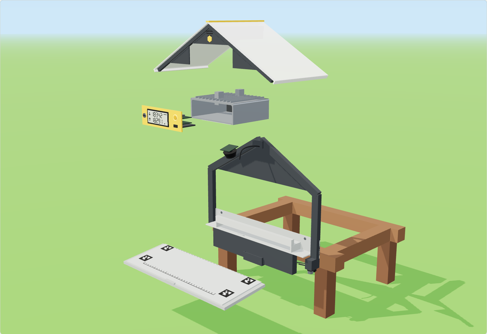

## Design decisions

### 1. The camera looks down from a fixed place

The prototypes used a varifocal 4K camera on a wall bracket above the entrance. Each installation had a different angle and distance, so bee size, speed and the counting line changed from hive to hive, and the camera was sometimes knocked out of alignment.

- **186 mm above the board, tilted 16° toward the hive.** A 90° low-distortion lens keeps the device low. The tilt adds the porch and the bottom of the hive wall to the view (see [section 2](#2-flight-and-landing-where-to-count)). On the board the view is still close to top-down, so pose keypoints, body length, pollen loads and mites are measurable, not just detectable. A fixed tilt beats a pivoting camera: no motor outdoors, and no calibration that drifts.
- **Locked optics.** A fixed M12 lens and a fixed working distance: every unit produces the same image, and models trained on one unit work on all of them.
- **The camera is a module.** The sensor board connects over MIPI CSI with its own flex cable. A global-shutter sensor, which pose analysis of fast wing and leg motion may need, can replace it without changing the pod.
- **Calibrated once, at the factory.** The camera hangs on the same wall frame that carries the porch and the board, and the head always lands in the same pocket, so the geometry is fixed. Each unit is calibrated once at the factory with a printed target (lens distortion, mm/px, the counting line). In use, the software compares the straight edges of the porch lintel and the board with that reference and raises an alert if the head has been knocked. The board stays plain: no markers or scales spoil the look.

4K stays. A cheaper low-resolution SKU would lose mites and pose, the data quality the product is built for. If a budget version is needed, it should be the same device with a smaller compute sled, not a worse camera.

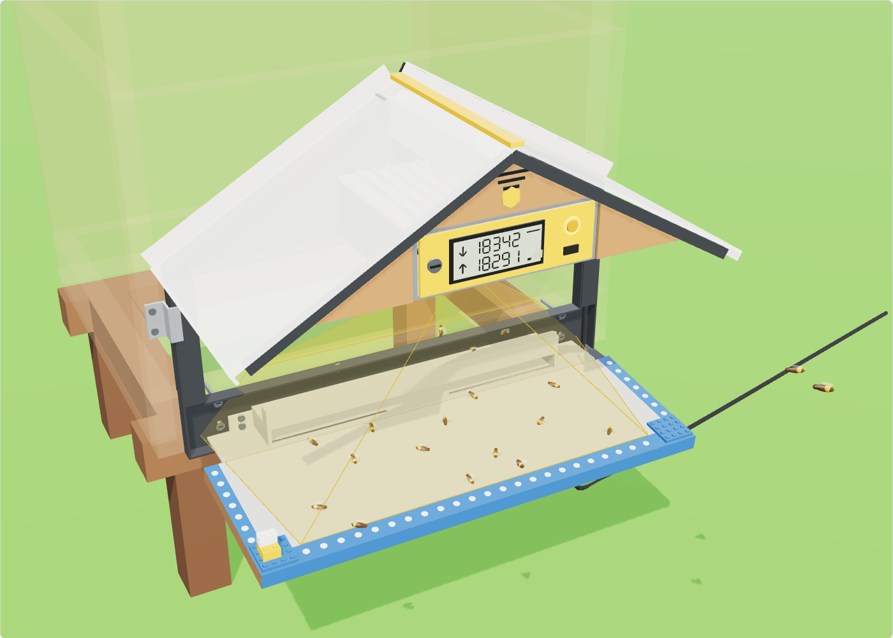

### 2. Flight and landing: where to count

Bees do not all land on the landing board. Some land on the hive wall and walk down into the entrance, especially at peak traffic, in wind, or when the board is small or steep. A camera that only sees the board would miss them, or see them appear at the entrance edge with no clear direction.

What matters is not where bees land but that every bee crosses one line the camera sees. So the design moves that line:

- **A porch moves the doorway onto the board.** A 46 mm deep, 17 mm high tunnel across the full 300 mm entrance, in the same matt grey as the board. A bee on the wall has to walk down onto the porch roof and step off in front of the mouth to get in. Every bee in or out crosses the porch mouth, in full view, and the mouth is the counting line.
- **The camera also sees the wall.** The 16° tilt adds the porch roof and the bottom ≈ 38 mm of the wall to the view. Bees that land on the wall are tracked from the moment they land, and the share of bees that land there is measured, not guessed.
- **Counting rule.** A track that ends inside the porch is *in*, a track that starts there is *out*, wherever it came from. Tracks that stay ambiguous are reported separately with a confidence value, not dropped (the telemetry already has `unknownDirection`).
- **Nothing to clean, nothing to light.** The porch is short and open-air, with no glass. Guard bees tend to like a defined doorway.
- **Colours in view are chosen for detection.** Board, porch, gate and apron are plain matt grey; the frame is matt graphite. The personal colours and the brick decks are all outside the view, so nothing in the image looks like a bee, and no bare metal throws glare.

Rejected alternatives: an enclosed glass tunnel with the camera behind the glass (propolis, dust and condensation on the glass, constant lighting, congestion at peak traffic, and the open view that pollen, guard and pose data depend on is lost), a pivoting camera (a motor outdoors and a calibration that drifts), and discouraging wall landings (the porch makes them harmless for counting, so the bees keep their natural flight).

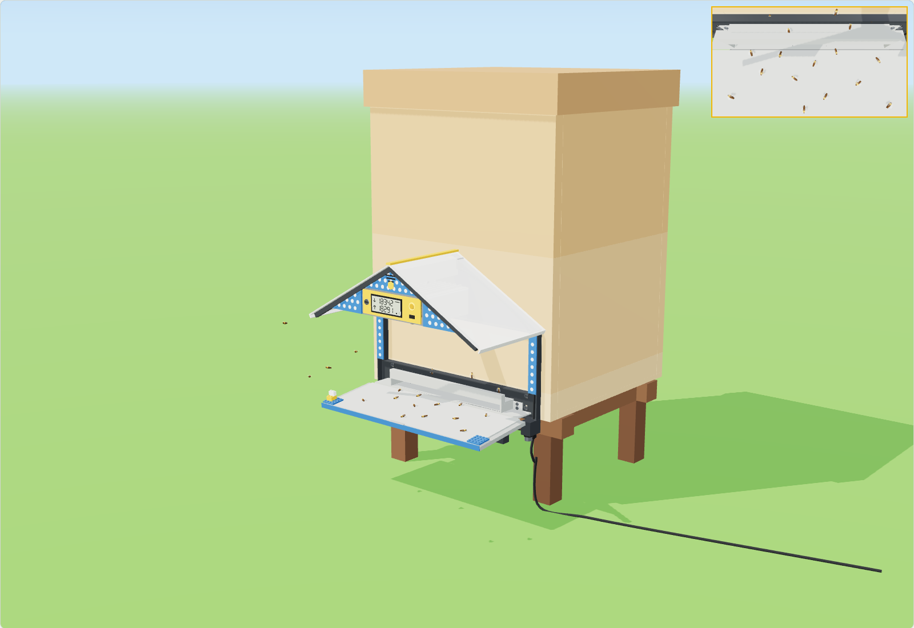

### 3. The automatic entrance gate

Beekeepers use entrance reducers all year: narrow against wind, cold and robbing, a hornet guard in late summer, closed for moving a hive. The porch mouth is the natural place for one, and the Observer is the first device that can move it at the right moment.

**Mechanism.** A 2 mm plate rises out of a slit in the porch floor, right at the mouth. It has a 70 mm notch in its centre, as deep as the porch is high, so a single travel gives four openings:

| Position | Gate top | Opening | Used for |
| --- | --- | --- | --- |
| Open | flush with the floor | full 312 × 17 mm | normal |
| Reduced | at the porch roof | 70 × 17 mm centre notch | wind, cold, robbing, beekeeper setting |
| Hornet guard | 11.5 mm above the notch | 70 × 5.5 mm slot: bees pass, hornets and wasps cannot | hornet at the entrance |
| Closed | notch at the porch roof | none | moving the hive, spraying nearby |

- When open, the gate is hidden under the floor: nothing in the view, nothing for bees to walk around.

| Open | Reduced |
| --- | --- |
| 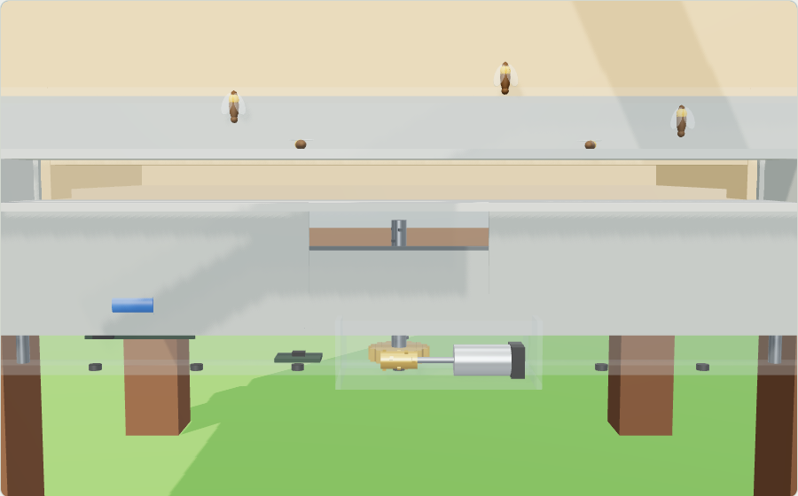 | 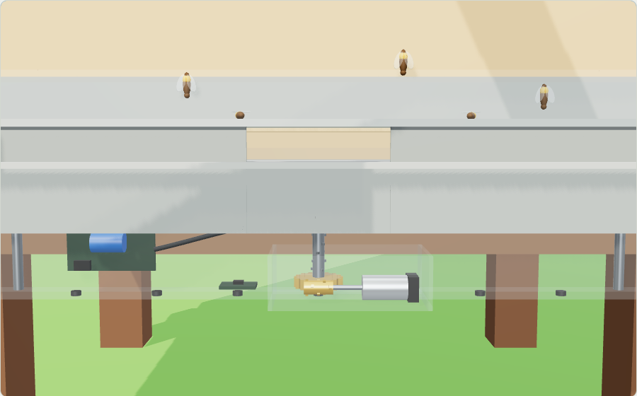 |
| **Hornet guard** | **Closed** |
| 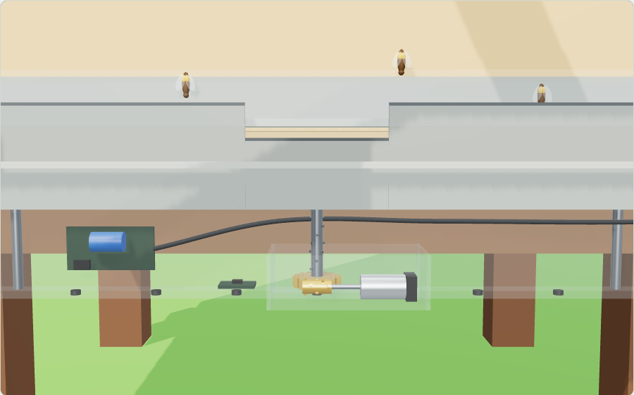 | 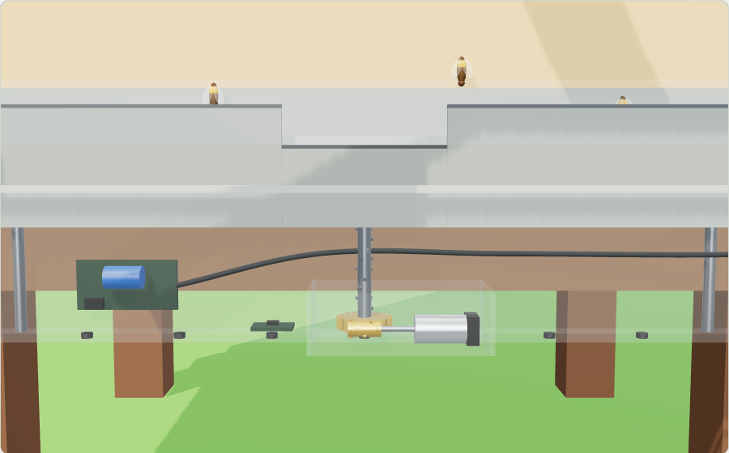 |

**Drive.** Everything sits in a sealed printed box under the porch floor, outside the camera view (in the images above it is drawn see-through and the landing board is lifted away):

- **Motor + worm.** An N20-size micro stepper with a brass worm on its shaft, in a small gearbox bulge in the middle of the box.
- **Worm wheel + lead screw.** The worm turns a wheel at the foot of a vertical 2 mm-lead screw. A worm drive is self-locking, so the gate holds any position without power, and neither bees nor hornets can push it.
- **Nut on the gate.** A brass nut on the lower edge of the gate turns the screw's rotation into 34 mm of travel, at about 7 mm/s.
- **Guide rods.** Two stainless rods at the ends, with bronze bushings on the gate, keep the 312 mm plate level so it does not jam in the slit.
- **Home sensor.** A hall sensor on the box floor and a magnet on the gate: the drive finds the open position after every power-up.
- **Fail-open supercapacitor.** A small driver board keeps a supercapacitor charged, with enough energy to drive the gate back to open.
- **Drain holes** in the bottom let water and debris that fall through the slit out.
- **Fails open.** If power is lost, the supercapacitor drives the gate open. Every narrowing is a lease with a timer, renewed only while its reason lasts; the supervisor opens the gate when a lease runs out.
- **Cannot crush bees.** The gate rises slowly (≈ 7 mm/s) with a soft silicone edge and a motor current limit, and only when the camera sees no bee in the mouth. If it stalls, it goes back down.
- A move takes about 5 s at 1 W: negligible energy.

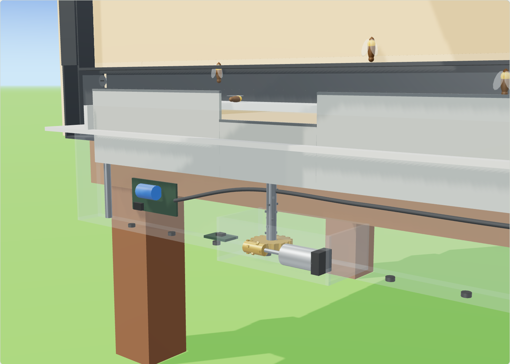

**Who moves the gate.** Decisions are made where the information is, and safety decisions never wait for a server:

| Trigger | Decided on | Position | Latency | Notes |
| --- | --- | --- | --- | --- |
| Hornet at the entrance (camera, confirmed by the hornet buzz on the microphone) | The Observer (compute) | Hornet guard | seconds | No network needed. Lifted 15 min after the last hornet. |
| Robbing (fights, erratic tracks, traffic spike) | The Observer (compute) | Reduced | minutes | Lifted when traffic is normal again |
| Cold night | Supervisor (ESP32), own temperature sensor | Reduced | — | Works while the computer is off |
| Strong wind or cold forecast | Web app, from the weather service | Reduced | minutes | Sent over the existing live-command channel; the device keeps the last command if the link drops |
| Beekeeper setting (per hive, schedule) | Web app | Any | minutes | Future hive "entrance" setting in the web app |
| Moving the hive, spraying | Beekeeper, in the web app or with the button | Closed | — | Always with a timer and an over-temperature release |
| Power loss, lease expired | Supervisor / supercapacitor | Open | — | Fail-safe |

Local safety (hornet, robbing, fail-open) overrides remote commands. A beekeeper setting sets the resting position that the gate returns to.

For a hornet, the design uses the hornet guard, not full closure. Closing the entrance leaves the foragers outside, where hornets hunt them, and a closed colony in late summer overheats. The guard keeps hornets out and lets bees home. Full closure is only for the beekeeper to choose, and always with a timer.

### 4. Roof, rain and snow

- **Closed at both ends.** At the back the wall frame sheet fills the triangle between the rafters. At the front a panel of oiled thermo-treated pine closes the roof above the pod, with the pod face set into it, the Gratheon hexagon and vent slots under the ridge so warm air leaves. Blown rain and snow no longer reach the pod or the beam; the eaves stay open for air.
- **Sealed against the hive wall.** Where the roof meets the hive, its back edge is turned up 16 mm with an EPDM strip pressed on the wall, like the flashing where a porch roof meets a house: rain running down the wall lands on the roof and leaves at the eaves. An EPDM strip behind the top edges of the wall frame stops water getting behind the frame.
- **Wi-Fi antennas.** Two flat dual-band antennas sit on the back of the wooden gable, either side of the pod and tilted apart for diversity. Wood and polycarbonate let the signal through; the metal pod (and the aluminium solar roof) would block it.
- **Steep gable, from the hive wall forward.** One 3 mm opal (light-diffusing) UV-stabilised polycarbonate sheet, bent once along the ridge into a 30° gable, 476 × 212 mm. It starts at the hive wall, so no rain gets in behind it. At 30° rain and snow slide off, and a flat roof would hold snow.
- **Drips land beside the board.** The ridge runs front to back, so water and snow go to the two side eaves, which overhang the landing board edges. Nothing drips onto the board in front of the camera.
- **Why not a cone.** A cone or hipped roof would also shed snow, but a front slope would drip onto the board, and a double-curved part needs a mould. A sheet bent once is cut and bent in any workshop.
- **Light.** Opal keeps the roof's shadow on the board soft, so it does not cut bees in half in the image. The camera meters on the plain grey board, with a short shutter time so bees in flight stay sharp.
- **Downward-facing window.** The lens window is at the tip of a matt black hood and faces the ground. Rain cannot reach it, the sky cannot reflect in it, and the roof keeps the sun off it. A 0.3 W heater film clears dew on cold mornings.
- **Light bars, rarely used.** Two short diffused LED bars with crossed polarisers on the LEDs and the lens remove glints from shiny bees and wet pollen. They only flash in sync with the exposure, at dusk or in deep shade.

### 5. Activity display

A beekeeper walking past the hive should see how the colony is doing without opening an app. The pod front, set into the front gable, has a cheap reflective 2-row segment LCD (about €3):

- **Today's bees in (↓) and out (↑)**, updated every minute, and four bars for the gate position. The button next to it pages through yesterday, net flow and alerts (hornets, robbing).
- **Reflective, no backlight.** It is readable in direct sun, where backlit screens wash out, and works in frost, unlike e-paper, which gets slow in the cold.
- **Driven by the supervisor**, the always-on ESP32, through an HT1621 segment driver at about 50 µA. It keeps the last numbers while the computer sleeps, so it is never blank.

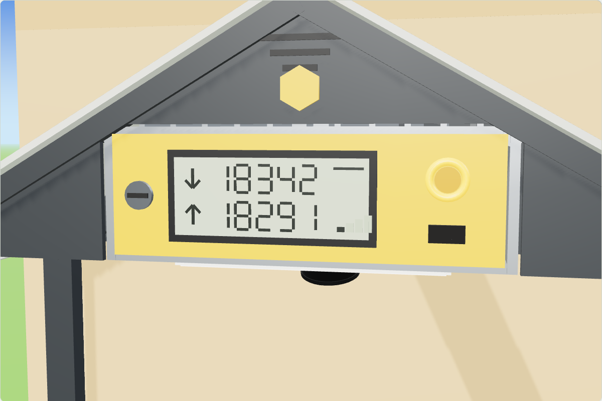

### 6. Structure: one metal part

The earlier arch had a full-width aluminium head and two side boards. They were expensive and bulky, and the side boards blocked bees flying in from the sides. The structure is now:

- **Wall frame.** One laser-cut sheet of 2 mm 5052 aluminium in the shape of a house gable, folded on a press brake and powder-coated matt graphite. No steel, no welds, no joints. The face lies against the hive; 15 mm folded returns along the outer edge and around the big window turn the uprights into U-channels open to the front (clip-in aluminium covers close them) and stiffen the gable. Cut-outs: the big window over the hive front, the entrance window, four slots for the wood screws, and holes for the four rivet nuts that take the porch. It is screwed to the bottom board (four screws beside the entrance) and, at the top, with two screws through the gable near the apex into the first hive body. The top screws go in before the head is hung, so the roof covers them afterwards: dry and out of sight. To lift the first hive body, lift off the head (one thumbscrew) and undo the two top screws.
- **Ridge beam.** A standard 30 × 36 mm aluminium extrusion that hooks into the apex of the frame, locked by one captive thumbscrew. It carries the roof, two thin front rafters (for snow on the front corners) and the pod. The whole head lifts off in seconds and lands in the same place.
- **Pod.** The only machined metal: a 170 × 140 mm piece of finned aluminium extrusion, IP65, with printed end caps. It holds the camera module, the compute sled (slides out of the front, with the honey-yellow service face and the display), the supervisor board and, in the solar version, the battery sled (slides out of the side). The pod is the heatsink: its fins sit in the ventilated space under the roof. No fan.
- **Sides are open.** Only the two slim uprights stand beside the board, against the hive wall, so bees can fly in from the front and the sides.

### 7. Wires: none in the sun, none in view

- All cables enter from below, under the foot of the right upright, facing the ground: a PoE cable gland and an M12 accessory socket. Water runs off them, not into them, and the cable leaves with a drip loop.
- The right upright is a U-channel closed by its aluminium cover. The harness runs up inside it, over the rafter and along the ridge beam to the pod. The gate drive plugs into the foot of the same upright.
- The porch floor widens into a grey apron up to the uprights, so the camera never sees the ground beside the porch. The frame, roof, pod and cables stay outside the view. The viewer's *Show what the camera sees* inset renders exactly what the lens sees.

### 8. Personal hive colours and brick decks

Beekeepers paint hive fronts in different colours so that bees find their own hive. It cuts drifting between hives, which also slows the spread of mites and disease between colonies. The Observer keeps its structure neutral (graphite frame, wooden gable, opal roof) and puts the personal touch where bees land:

- **Painted landing board edges.** The wooden landing board is painted in the hive colour around the grey insert (both sides and the front) and on its front lip, with bee-safe water-based paint. Colours are ones bees see well: blue, yellow, white or graphite. Red is not offered, because bees see it as black. Each can be plain or carry dots, stripes or chevrons in a contrasting colour; bees recognise patterns as well as colours. Neighbouring hives get different combinations.
- **Outside the camera view.** The painted border is outside the image. The grey insert the camera sees is the same on every unit.
- **Brick decks.** Two 32 × 32 mm decks on the front corners of the landing board, in the hive colour, carry a 4 × 4 grid of 8 mm studs compatible with common toy construction bricks. Owners can put their own figures and decorations there, and it makes each hive recognisable to people too. The decks are outside the camera view and beside the flight path.

| Yellow, stripes | White, chevrons | Graphite, plain |
| --- | --- | --- |
| 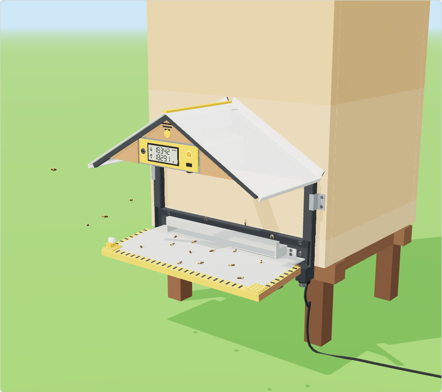 | 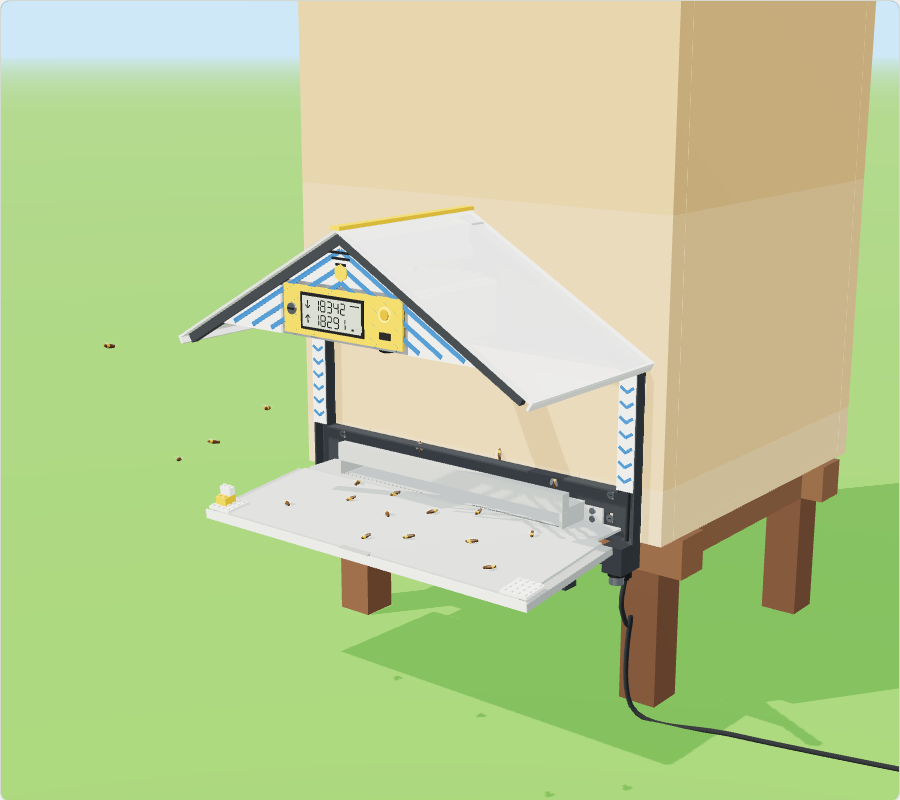 | 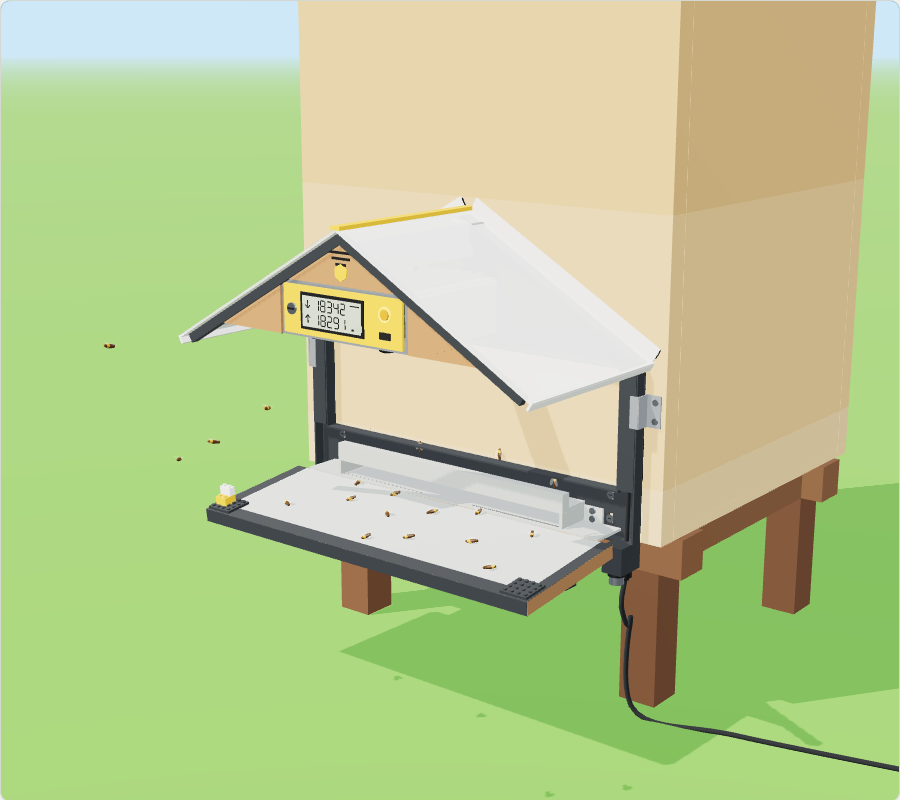 |

### 9. Installation, step by step

The viewer's *Install* section plays these steps back, with the parts of each step highlighted.

| Step | What to do | Fasteners |
| --- | --- | --- |
| 1. Wall frame | Hold the frame so its entrance window lines up with the entrance; the paper template in the box marks the holes. Screw it to the front of the bottom board, two screws each side of the entrance; the vertical slots allow ±3 mm to level it. Then drive two screws through the slots in the gable, near the apex, into the first hive body; they pull the frame against the wall, where the EPDM strip behind it seals. The head goes on over them in step 4. | 4 × countersunk wood screw 4.5 × 40 mm (bottom board) and 2 × pan-head wood screw 4.5 × 40 mm with EPDM-backed washers (top), A2 stainless, Torx T20 |
| 2. Porch with gate | Slide the porch over the entrance so its side tabs lie on the plate, and screw the tabs to the rivet nuts in the plate. The gate and drive come fitted. Plug the gate lead into the socket at the foot of the right upright. | 4 × M4 × 10 button screw, A2 stainless, into M4 rivet nuts |
| 3. Landing board and covers | Drop the board's two hinge knuckles onto the stainless pins at the front of the porch floor; it rests at 6° on its stop. The board comes painted in the hive colour chosen at order. Clip the two aluminium covers into the upright channels. | none (pins and clips) |
| 4. Head | Lower the head so the hook at the back of the ridge beam drops into the pocket at the apex of the frame, and turn the yellow thumbscrew. The EPDM flashing on the back edge of the roof presses against the hive wall. Roof, pod, antennas and camera come pre-assembled and aimed. | 1 × captive thumbscrew M6 |
| 5. Cable | Push the PoE cable up through the gland under the foot of the right upright and tighten the gland nut; leave a drip loop. With the beehive scale, plug the M12 lead into the scale connector. | PG7 cable gland |
| 6. Pair | Hold the setup button for 5 s and pair the Observer with the hive in the web app over Bluetooth. | — |

On the beehive scale, step 1 is different: the frame bolts to two printed risers, each held by one M6 thumbscrew in a threaded insert in the scale's front wall, 2 mm clear of the hive, so nothing is weighed. On the Robotic Beehive it bolts to the cabinet front.

| 1. Wall frame | 2. Porch with gate |
| --- | --- |
| 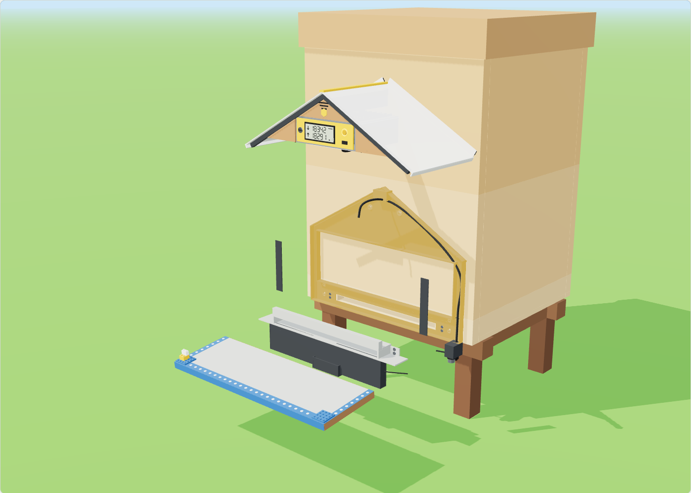 | 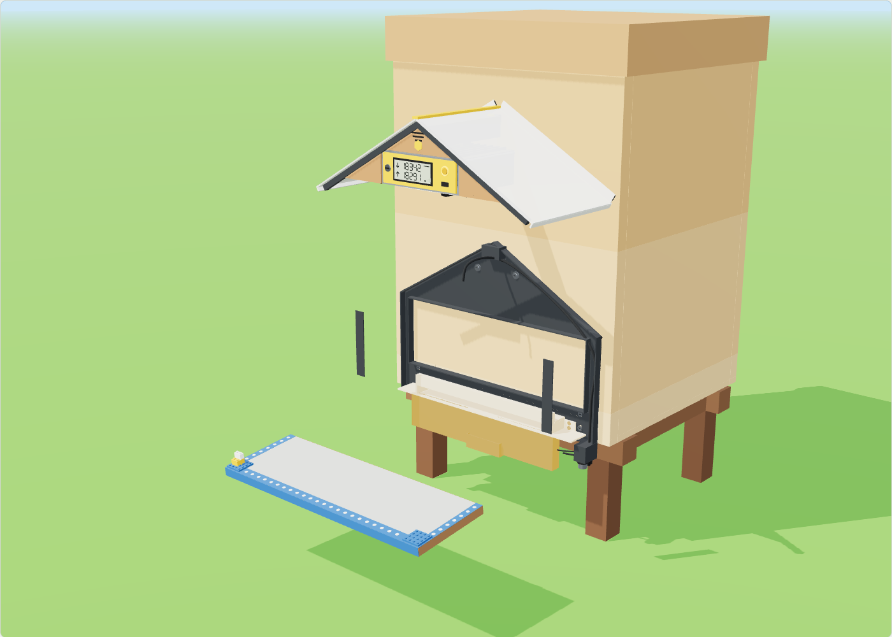 |
| **3. Board and covers** | **4. Head** |
| 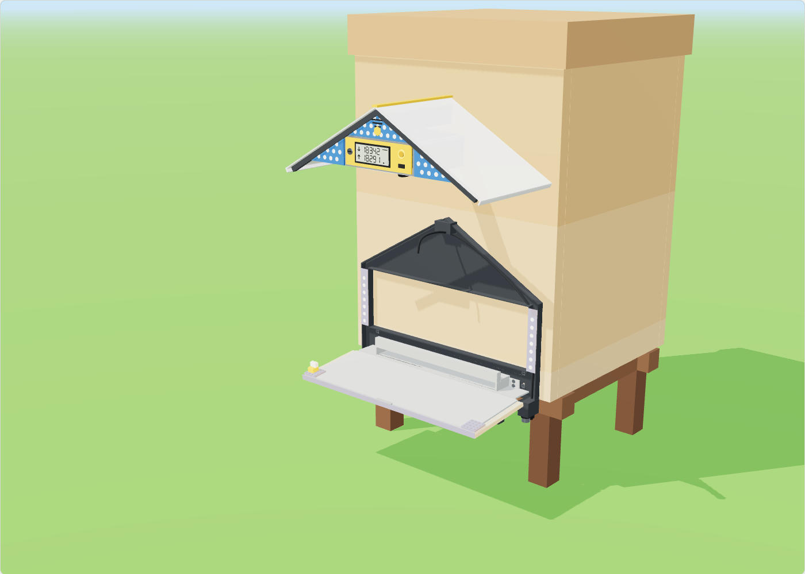 | 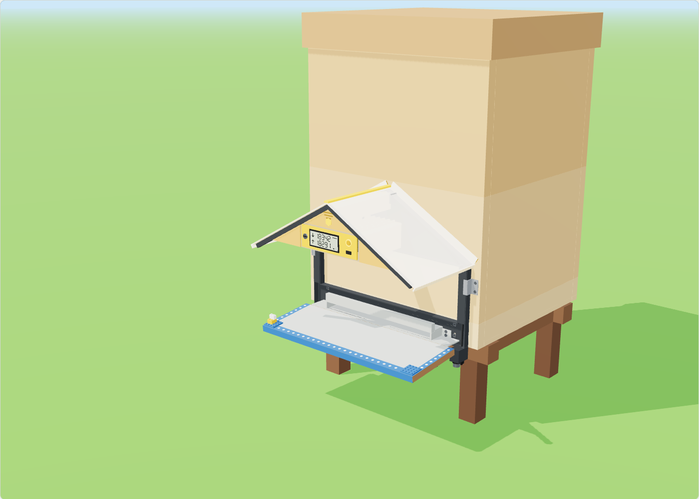 |

**Materials and processes**

| Part | Material | Process | Fixed with |
| --- | --- | --- | --- |
| Wall frame | 2 mm 5052-H32 aluminium, matt graphite powder coat | laser cut, press-brake folded | 4 wood screws to the bottom board |
| Porch, lintel, apron | HDPE, matt grey (camera background, gate slides through it) | CNC routed | 4 × M4 into rivet nuts in the frame |
| Gate | 2 mm HDPE plate, silicone edge | CNC routed | brass nut on the lead screw |
| Gate drive housing | folded aluminium sheet, gasketed lid | laser cut, folded | 4 × M3 under the porch floor |
| Landing board | 15 mm thermo-pine with a flush 3 mm HDPE insert where the camera looks, aluminium stiffener | CNC routed; border painted with water-based paint | hinge pins |
| Upright covers | aluminium sheet, graphite powder coat | laser cut, folded | clip-in |
| Brick decks | ASA (recycled grade) in the hive colour | 3D printed (pilot), injection moulded later | 2 × M3 into the board |
| Wall seal, roof flashing | EPDM foam strip | cut to length | self-adhesive, pressed by the frame and roof |
| Ridge beam | 30 × 36 mm aluminium extrusion, anodised | cut to length | hook + thumbscrew into the apex pocket |
| Roof | 3 mm opal polycarbonate (diffuser: its shadow on the board stays soft); solar version in white powder-coated aluminium sheet | cut, cold-bent once | 4 × M4 with EPDM washers to the beam |
| Front gable | 12 mm oiled thermo-pine | CNC routed | 4 × wood screws to the front rafters |
| Wi-Fi antennas | flexible dual-band PCB antennas | bought in | self-adhesive on the back of the gable, U.FL to the pod |
| Pod | finned aluminium extrusion, anodised, printed end caps | cut, machined | 2 × M5 to the beam |

Nothing is plain steel and nothing rusts: wood, aluminium and A2 stainless fasteners, with plastic only for the camera background, the porch the gate slides through, the roof diffuser, the pod end caps and the brick decks.

### 10. Service and manufacturing

- **Service.** The compute sled slides out of the front of the pod after a quarter-turn: status ring, setup button, USB-C for copying full-resolution research clips on site. The board insert slides out for washing, and the porch comes off (4 screws) for cleaning at the end of the season. The entrance module stays on the hive all year and works as an automatic reducer even while the head is away.
- **Parts any workshop can make.** One laser-cut folded sheet (frame), one standard extrusion cut to length (beam), one finned extrusion (pod), a cut and bent polycarbonate sheet (roof), CNC-routed HDPE board and porch, and 3D-printed ASA small parts for pilot batches.
- **Flat-pack.** Frame, roof and board ship flat with the pod: a box of about 500 × 400 × 110 mm.

### 11. Works alone, works better together

The entrance module and head are the same in all three setups. Only what the frame stands on changes.

| Setup | Mount | Power | Data |
| --- | --- | --- | --- |
| **Alone on a hive** | Wall frame, 4 screws to the bottom board | PoE+ from a switch or injector (up to 100 m), 12–24 V DC, or the solar roof | Ethernet or Wi-Fi |
| **With the beehive scale** | The frame stands on two printed risers bolted to threaded inserts in the scale's front wall (one M6 thumbscrew each), 2 mm clear of the hive; the porch bridges the gap over the deck with a brush seal. Frame, roof, snow and bees on the board are carried by the scale base and never weighed. | The Observer powers the scale pod over the M12 lead (5 V). The scale itself has no landing board or solar: it runs on batteries alone and needs no charging while an Observer is fitted | The scale sends weight, hive temperature and humidity over UART; the Observer uploads both and syncs the time. A falling weight plus robbing traffic is a stronger robbing signal for the gate. |
| **On the Robotic Beehive** | The frame is bolted to the cabinet front, where the entrance tunnel ends | From the robot PoE switch, cable inside a corner post | The robot uses entrance activity to choose when to inspect, and closes the gate while a box is open. Heavy models (pose) can run on the robot's Jetson. |

The M12 accessory port has the same pinout as the scale's front connector: 5 V out, ground, 1-Wire, UART, wake, shield.

Interface requirement for the Robotic Beehive: the entrance tunnel must end in the Observer porch (≤ 312 mm wide at the front, currently 480 mm).

Interface requirement for the beehive scale: the scale's hive climate probe (temperature + humidity) plugs into a socket in the scale's front-right hive locator and lies in a groove along the front of the deck into the entrance. The porch floor covers that groove; it needs a 3 mm notch at its back right corner so the lead enters the entrance under the porch roof, out of the camera view.

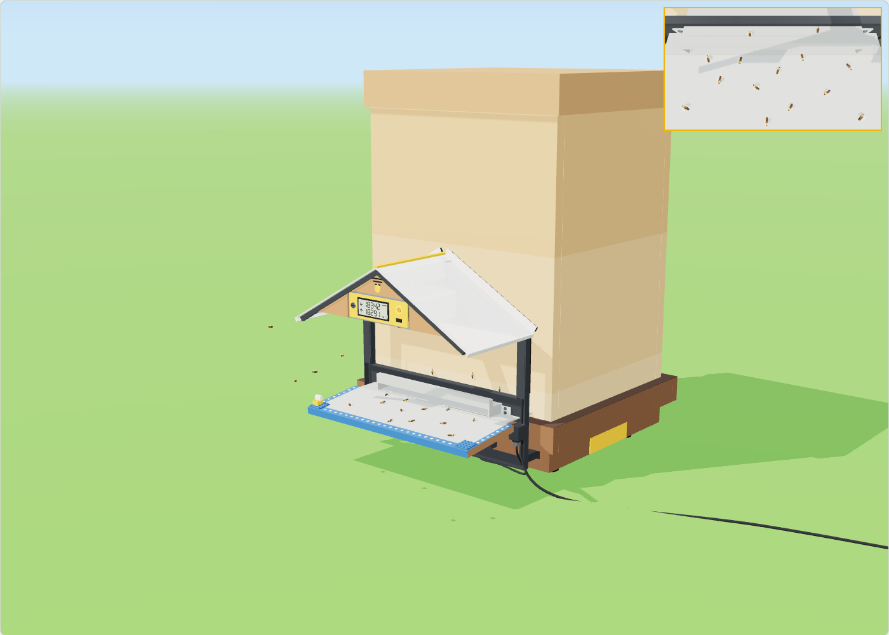

## Energy

The computer is the only large consumer. It runs only when bees can fly, and the always-on supervisor decides when that is.

| State | Draw | When |
| --- | --- | --- |
| Asleep | ≈ 0.12 W (supervisor, sensors, idle regulators) | Night, rain, below ≈ 10 °C, winter |
| Observing | ≈ 9 W (Pi 5 + Hailo-8 + 4K camera + Ethernet) | Flight weather, daylight |
| Booting | ≈ 5 W for ≈ 25 s | Before each observation in sampled mode |
| Moving the gate | ≈ 1 W for ≈ 5 s | A few times a day at most |
| Display | ≈ 50 µA | Always |

The prototype Jetson Orin Nano measured 6.9 W at 720p. The 9 W figure assumes 4K capture and is an estimate until the Pi 5 + Hailo sled is measured.

| Mode | Energy per flight day (12 h) | Use |
| --- | --- | --- |
| Continuous | ≈ 111 Wh | PoE / mains: counts, tracks and clips all day |
| Sampled (2 of every 10 min) | ≈ 27 Wh | Solar: traffic curve with 20 % coverage, clips on anomalies |
| Asleep all day | ≈ 3 Wh | Rain, cold, winter |

**Solar version.** A 7 W ETFE panel is laminated on each roof slope (14 W). From May to August in Estonia they yield about 44 Wh/day (≈ 4.5 sun-hours, 70 % system efficiency), which covers the sampled mode with margin. Whichever way the hive faces, one slope catches the morning or afternoon sun. Energy demand follows the weather: bees fly when it is sunny and warm, which is when the panels produce. On rainy or cold days the Observer stays asleep at ≈ 3 Wh/day, so the 77 Wh LiFePO4 battery lasts about 3 weeks without sun. Flight weather without sun (warm and overcast) is the worst case: about 2.5 days of sampled observation from a full battery. The gate keeps working on the supervisor alone even when the battery is too low for the camera.

**PoE is the default** because it solves power and the unreliable apiary Wi-Fi seen in the field test with one outdoor cable. Pose models and 60 FPS research capture need continuous power anyway.

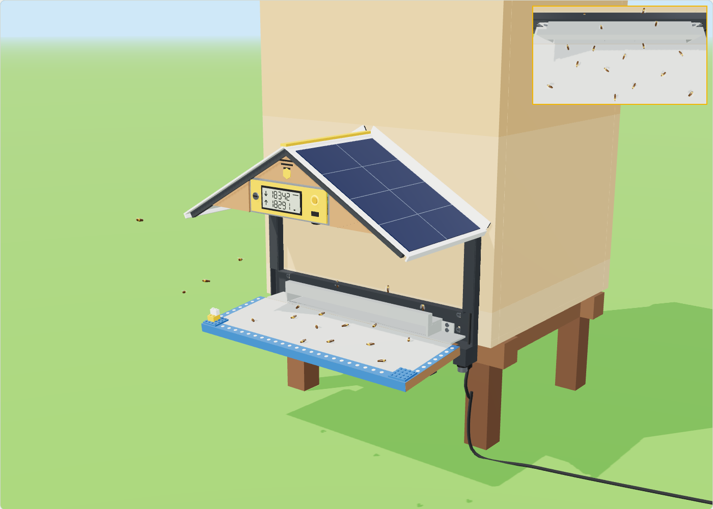

## Competition

| | ApicAI (DE) | Beemate (AU) | Purple Hive (AU) | Gratheon Entrance Observer |
| --- | --- | --- | --- | --- |
| Focus | Pollination, counts | Counts, live stream | Varroa only | Counts, tracks, pollen, varroa, pose |
| Camera | Jetson at the entrance | HD | 2 cameras, 1 photo/s | 4K over wall, porch and board, locked optics, factory-calibrated, porch as counting line |
| Acts on what it sees | — | — | SMS alerts | Automatic gate: hornet guard, reducer, fail-open |
| Power | Mains / solar | Mains | Solar, 4G | PoE, or solar roof |
| Integration | Scale + sensors | — | — | Beehive scale (power + data), Robotic Beehive |
| Openness | Closed | Closed | Closed | Open source hardware and software |

## Open questions

- A thermo-pine porch with a thin HDPE top would replace most of the remaining plastic; test whether the gate slit stays clean and square in wood.
- Check the frame and the EPDM seal on hives with front hand cleats and on rough or painted hive fronts.

- Measure the porch's cost to the bees: run two hives side by side on beehive scales, one with the porch and one without, and compare daily weight gain and forager traffic.
- Measure how many bees land on the wall at all, from the wall strip in view, over a season and at different traffic levels.
- Label clips by hand, with and without the porch, and compare against the automatic in/out counts.
- Gate: confirm the 5.5 mm slot against local hornet species (Vespa velutina, Vespa crabro) and drones; test whether one 70 mm opening is enough for autumn traffic under hornet pressure, or whether the notch should be wider or split in two.
- Gate: debris and propolis in the floor slit over a season, and whether the slit needs a brush seal.
- Measure Pi 5 + Hailo-8 with 4K capture, tracking and encoding at the same time: watts, FPS, thermal behaviour in the pod at 35 °C ambient.
- Check the wall frame against hive bodies with front hand cleats: the uprights may need standoffs.
- Snow load on the roof front corners with only the ridge beam and front rafters; test at 30° vs 35°.
- Global vs rolling shutter for pose: compare the two camera modules side by side on the same head.
