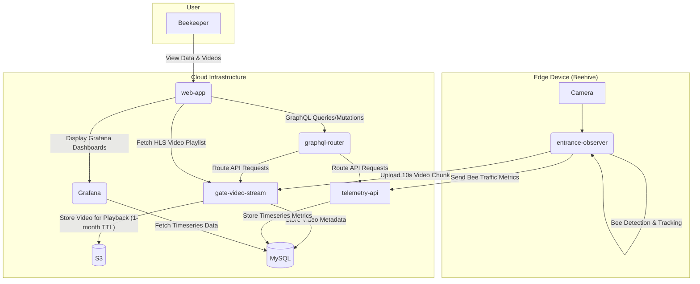
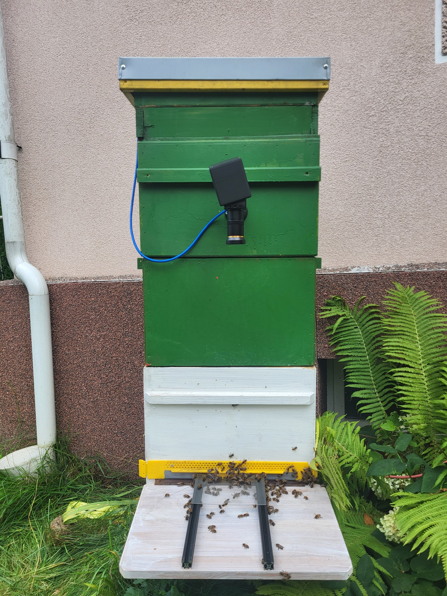
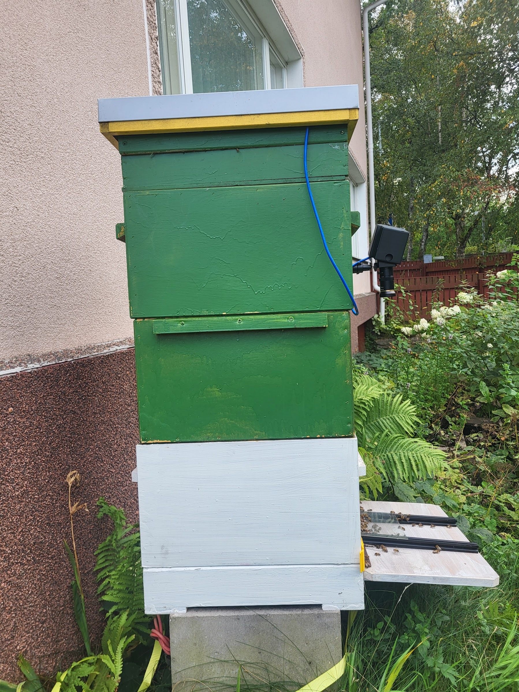

# Real-Time Analysis of Honey Bee Behavior with Gratheon's entrance-observer: A Computer Vision System for Tracking Forager Traffic and Movement Speed

## Abstract

Traditional beekeeping practices rely on manual, intrusive, and time-consuming inspections to monitor colony health, a process that is both inefficient and stressful for the bees. This paper presents a practical methodology for non-invasive beehive monitoring through real-time data collection and metric aggregation in the cloud. The system, called the `entrance-observer`, uses an NVIDIA Jetson Orin Nano and a 4K USB camera to continuously record and analyze video of the hive entrance. A YOLOv8n-based AI model processes the video in real-time, detecting and tracking individual bees to collect a rich set of metrics, including forager traffic and individual bee tracks. Our methodology introduces the analysis of bee movement speed on the landing board as a key metric, providing a novel proxy for colony health and foraging intensity. This data is uploaded to a cloud-based web application for long-term observation, enabling comparison with other colonies and correlation with external factors like weather. The breakthrough of this methodology lies in its ability to move beyond simple bee counting, providing nuanced data that can be used to detect complex behaviors such as orientation flights, pollination activity, swarming, and robbing behavior by bees from other hives. This provides beekeepers with actionable insights into colony health, with a particular focus on assessing pollination efficiency, forager loss, and creating a foundational video dataset for future Varroa mite detection models. The paper details the system architecture, the experimental methodology, and preliminary findings from a deployment in a suburban apiary in Tallinn, Estonia. The `entrance-observer` system offers a practical and scalable solution to some of the most pressing challenges in modern beekeeping, with the potential to improve colony health, increase productivity, and make beekeeping more sustainable.

## 1. Introduction

Honey bees (Apis mellifera) are essential for global food security, yet beekeepers face immense challenges in maintaining healthy colonies. Traditional beekeeping is characterized by unscalable work that relies on frequent, time-consuming, and physically demanding manual inspections. Beekeepers must make critical decisions about colony health, but they often lack the up-to-date and correct information needed to do so effectively. A primary threat is the Varroa destructor mite, a parasite that can decimate a hive if not managed effectively. Traditional monitoring methods, such as manual inspections, are labor-intensive, stressful for the bees, and often fail to provide the timely data needed for effective intervention. While tools like hive scales can indicate changes in foraging activity, they do not offer insights into the underlying causes, such as disease, forager loss, or parasite load.

The limitations of existing methods highlight the need for more advanced, non-invasive monitoring solutions. The ability to automatically detect parasites like Varroa mites and other threats at an early stage would be a significant breakthrough for beekeepers, enabling them to apply targeted treatments only when necessary, thereby reducing chemical use and improving colony health. Furthermore, detailed monitoring of forager traffic can provide valuable information about pollination efficiency and the impact of environmental stressors, such as pesticides. This research focuses on solving several key problems for beekeepers through continuous video analysis:

*   **Swarming Prevention:** Early detection of pre-swarming behaviors to prevent colony loss.
*   **Pest and Predator Attacks:** Identifying attacks from hornets, wasps, or robbing bees from other hives.
*   **Queen Health Monitoring:** Observing the queen's initial mating and orientation flights.
*   **Seasonal Behavior Tracking:** Monitoring events like the seasonal expulsion of drones from the hive.
*   **Foraging Activity Analysis:** Correlating forager traffic with weather and environmental conditions to assess colony productivity.

This paper presents a practical methodology for beehive entrance monitoring that aims to address these challenges. We have developed a scalable system called the `entrance-observer`, which uses a camera and an AI model running on an edge device to continuously analyze bee activity. The `entrance-observer` is available as open-source software under the AGPL license at https://github.com/Gratheon/entrance-observer/. The system is designed not only to count bee traffic but also to analyze movement dynamics, such as movement speed on the landing board, as a novel indicator of colony status. This serves as a platform for developing more advanced diagnostic tools, with a primary focus on the detection of Varroa mites and other parasites. This paper details the system's architecture, the methodology for its deployment and data collection, and discusses its potential to become a valuable tool for modern, sustainable beekeeping.

## 2. Related Work

The application of technology to beekeeping, often referred to as "precision beekeeping," has been a growing area of research in recent years. A significant body of work has focused on the use of sensors to monitor the internal conditions of the hive, such as temperature, humidity, and acoustics [5]. While valuable, these methods do not capture the full picture of colony activity.

Computer vision has emerged as a powerful tool for non-invasive beehive monitoring. Early work focused on tracking marked bees or using RFID tags, but these methods are intrusive. More recent approaches have focused on tracking unmarked bees. For example, Rodriguez et al. [1] developed a system using convolutional neural networks (CNNs) and Part Affinity Fields (PAFs) for pose estimation, allowing for accurate tracking and pollen detection. Marstaller et al. [2] proposed "DeepBees," a multi-task CNN architecture for genus identification, pollen detection, pose estimation, and classification of bees.

A major focus of computer vision research in beekeeping has been the detection of the Varroa destructor mite. Traditional methods are intrusive and harmful to bees. Non-invasive approaches have explored the use of hyperspectral imaging to improve the contrast between mites and bees [3], and the use of object detectors like YOLOv8 and SSD for mite detection [4]. Bilik et al. [4] found that training a model to detect "infected bees" as a class was more effective than detecting the mites themselves.

The system presented in this paper builds upon this existing body of work, but with a specific focus on providing a practical and easy-to-use solution for beekeepers. Unlike many previous systems, which have been primarily research-focused, the `entrance-observer` is designed to be a practical tool that can be deployed in real-world apiaries. It utilizes a state-of-the-art YOLOv8 model for bee detection and tracking, and is specifically designed to address the key challenges of forager loss, pollination efficiency, and Varroa mite detection.

## 3. System Architecture
### 3.1. Hardware

The hardware for the `entrance-observer` system is designed to be a powerful and robust platform for edge computing. The core of the system is an NVIDIA Jetson Orin Nano 8GB, a compact and powerful single-board computer with a GPU that is well-suited for running AI models.

The video data is captured by a Mokose 4K USB camera, which is equipped with a 5-50mm varifocal lens. This combination allows for high-resolution video capture and the flexibility to adjust the field of view to suit different hive entrance configurations. The camera is mounted on an articulating arm, which allows for precise positioning.

### 3.2. Bill of Materials

The following table details the components used to build the `entrance-observer` system, along with their approximate costs as of September 2025.

| Component | Description | Price |
| --- | --- | --- |
| **Compute Module** | NVIDIA Jetson Orin Nano 8GB Developer Kit | $249.00 |
| **Display** | 7-inch Capacitive Touch Screen, 1024x600 | $47.99 |
| **Camera** | MOKOSE 4K@30fps USB Camera | $154.50 |
| **Camera Lens** | 5-50mm HD CCTV Lens, 3MP, Aperture F1.4 | €43.35 |
| **Storage** | SanDisk SSD Plus M.2 250GB NVMe SSD | €23.88 |
| **Connectivity** | Waveshare AC8265 Wireless NIC for Jetson Orin Nano | €22.92 |
| **Enclosure** | Acrylic Clear Case for NVIDIA Jetson Nano | €11.36 |
| **Camera Mount** | Security Wall Mount with 1/4 Screw Head | $9.59 |
| 3d printed cover|||
| **Total** | | **~$461 + €101.51** |

### 3.3. Software
#### 3.3.1. entrance-observer application

The `entrance-observer` application is a Python-based software package that runs on the edge device. It is responsible for capturing video, processing it in real-time, and uploading the results to the cloud. The application is built using a modular architecture, with different components responsible for different tasks.

The overall system architecture is composed of several microservices that work together to collect, process, and display the data from the beehive. The following diagram illustrates the flow of data and the interactions between the different components:

The video processing pipeline is built using OpenCV. It captures frames from the camera, resizes them to a manageable resolution, and then passes them to two separate queues: one for video writing and one for AI processing. This multi-threaded approach ensures that the video capture process is not blocked by the computationally intensive AI processing.

#### Metrics

Bee detection and tracking is performed using a YOLOv8 model. The model has been pre-trained on a large dataset of bee images and is able to detect and track individual bees with a high degree of accuracy. The application uses the tracking information to calculate a rich set of metrics, including:

*   **`bees_in`**: The number of bees entering the hive.
*   **`bees_out`**: The number of bees exiting the hive.
*   **`net_flow`**: The difference between `bees_in` and `bees_out`.
*   **`avg_speed_px_per_frame`**: The average speed of the bees.
*   **`p95_speed_px_per_frame`**: The 95th percentile of bee speed.
*   **`stationary_bees_count`**: The number of bees that are not moving.

The application also provides a local web UI, which is built using Flask. The web UI allows the user to view a live video feed from the camera, monitor the bee traffic statistics, and adjust the camera settings.

#### 3.3.2. Gratheon web application

The Gratheon web application is a cloud-based platform that provides a centralized location for storing, visualizing, and analyzing the data from the `entrance-observer` devices. The web application provides a user-friendly interface that allows beekeepers to:

*   View video playback from their hives.
*   Monitor the bee traffic statistics in real-time.
*   Analyze historical data to identify trends and anomalies.
*   Receive alerts and notifications about important events, such as a sudden drop in forager activity or a potential hornet attack.

The web application is designed to be a powerful tool for beekeepers, providing them with the information they need to make informed decisions about the management of their colonies.

## 4. Methodology
### 4.1. Experimental Setup

The experiment was conducted in a suburban apiary located in Tallinn, Estonia (Pirita-Kose district, Geo coordinates 59.436962 x 24.753574). The beehive used for the study was a 3-section vertical hive with Estonian frames, manufactured by Karlwood. The hive was positioned on four large bricks, with the entrance facing south-west, and was protected from the wind by a house wall on the eastern side.

The `entrance-observer` device was installed at the hive entrance, with the camera positioned above the entrance to provide a clear, top-down view of the bees. The camera was mounted on a "Security Camera Mount Bracket for Camera with 1/4 Screw Head Wall Mount," which allowed for precise and stable positioning. The NVIDIA Orin Nano was housed in a wooden enclosure on top of the hive, physically separated from the bees to avoid any disturbance. Power was supplied to the device via an extension cord connected to a standard 220V household outlet.

During the setup process, several hardware and software challenges were encountered. On the hardware side, the NVIDIA Jetson Orin Nano did not provide sufficient power to the Mokose 4K camera over USB3. An attempt to use an external powered USB hub resulted in the camera and several USB ports on the Jetson Orin Nano being damaged due to an incorrect voltage setting (12V instead of 5V). As a result, a backup camera had to be used, connected to the single remaining USB-C port, which limited the video capture to USB2 speeds. This hardware failure constrained the video resolution to 1280x720 and the frame rate to 15 FPS. Additionally, the Wi-Fi signal at the apiary was not strong enough for the Jetson Orin Nano to maintain a stable connection, so a TP-Link Wi-Fi extender was installed to boost the signal.

On the software side, installing PyTorch with GPU support on the Jetson Orin Nano proved to be a significant hurdle. Furthermore, initial attempts on September 3rd to implement a high-performance, GPU-accelerated video capture pipeline using GStreamer were unsuccessful. This effort was hampered by persistent "Argus" errors related to the camera drivers and the discovery that the Jetson Orin Nano's hardware does not include a dedicated h264 encoder chip. This limitation prevented efficient, high-resolution video compression on the device. Consequently, this approach was abandoned in favor of a less efficient, purely software-based video capture method using OpenCV, which contributed to the constraints on frame rate and resolution. This experience suggests that alternative hardware, such as an Apple Mac Mini or a newer NVIDIA Jetson model with more robust multimedia encoding capabilities, could be a more viable option for future iterations.

To overcome the PyTorch dependency issues, a Docker-based approach was adopted, using the official Ultralytics Docker image. While this solved the dependency issues, it also meant that a native Python UI could not be used. Consequently, a web-based UI was developed to provide a way to preview the results and configure the system. For connectivity, the system initially relied on a local area network (LAN) for remote access via SSH and a web interface. This was later upgraded to Tailscale, a commercial VPN solution, which enabled secure remote monitoring and video file downloads from any location, facilitating off-site system checks and data retrieval.

### 4.2. Data Collection

Data collection began on September 4th and is ongoing, with the goal of capturing approximately two weeks of data before the onset of cold weather. Data collection is not uniform as we were changing the system, had to periodically maintain and resolve ongoing issues. The `entrance-observer` application is configured to record video in 30 second chunks, covering the full daylight hours.

The raw video files are periodically synchronized from the Jetson Orin Nano to a remote machine for backup and further analysis using a shell script that leverages `rsync`. This script runs in a continuous loop, ensuring that the video data is efficiently and reliably transferred over the Wi-Fi network.

#### 4.2.1 Correlating data with weather and plant blooming factors
In addition to the video data, historical weather data for the apiary's location is being collected from the Open-Meteo API (`archive-api.open-meteo.com`). This data includes a wide range of meteorological variables, such as solar radiation, wind speed and gust, cloud cover, precipitation, atmospheric pressure, and air pollution (PM2.5 and PM10).

### 4.2.2. Dataset Availability

The video datasets collected during this research are publicly available at [https://gratheon.com/research/Datasets](https://gratheon.com/research/Datasets). The collection includes the following:

**2025, September 5th:**
*   **Duration:** Approximately 4 hours (11:30 to 16:30).
*   **Setup:** Camera zoomed on the landing board (~40cm wide).
*   **Specifications:** 1280x720px resolution, 15 FPS, recorded in 30-minute chunks.
*   **Total Size:** ~25GB.
*   **File Naming:** Filenames are UTC timestamps.

**2025, September 7th onwards:**
*   **Setup:** Camera zoomed on the landing board area (~23cm wide) for higher detail.
*   **Specifications:** 1280x720px resolution, 15 FPS, recorded in 30-minute chunks.
*   **File Naming:** Filenames are UTC timestamps.

### 4.2.1. AI Model Training

The bee detection model was trained using the YOLOv8n architecture, chosen for its optimal balance of speed and accuracy on edge devices like the NVIDIA Jetson Orin Nano. The training was conducted in the Google Colab environment, leveraging its cloud-based GPU resources (NVIDIA T4).

The model was trained on the "Bees on Hive Landing Boards" dataset, which was sourced from Roboflow. The dataset consists of 14,199 training images, 1,353 validation images, and 676 test images. The training data was augmented with three outputs per training example, using techniques such as rotation (between -15° and +15°), brightness adjustments (between -15% and +15%), and exposure adjustments (between -10% and +10%) to improve the model's robustness.

After 25 epochs of training, the model achieved a mean Average Precision (mAP50-95) of 0.77 on the validation set, demonstrating a high of accuracy in detecting bees. The initial weights for the YOLOv8n model were adapted from the 'Counting bees with the LABRADOR board' project [36], which provided a strong foundation for our bee detection model.

### 4.3. Data Analysis

The data analysis pipeline is designed to provide both real-time insights and in-depth, long-term scientific investigation. The process begins at the edge, where the `entrance-observer` application processes video in 30-second chunks, as configured by the `VIDEO_CHUNK_LENGTH_SEC` environment variable. For each chunk, the system calculates the bee traffic metrics described in Section 3.2.1. These metrics are then transmitted to the Gratheon web application's telemetry API.

Each 30-second aggregation of metrics is stored as a distinct `EntranceMovementRecord` in a MySQL database, linked to its corresponding hive and section ID. This granular, time-stamped data structure provides a rich dataset for detailed analysis. The metrics stored for each interval include `bees_in`, `bees_out`, `net_flow`, `avg_speed_px_per_frame`, `p95_speed_px_per_frame`, `stationary_bees_count`, and `detected_bees`.

The second stage of the analysis focuses on correlating the bee traffic data with the historical weather data. While the Gratheon web application provides real-time visualization of these correlations through **Grafana dashboards**, a more rigorous statistical analysis will be performed to quantify the relationships between bee behavior and environmental factors. The planned statistical methods include:

*   **Descriptive Statistics:** Basic descriptive statistics (mean, median, standard deviation) will be calculated for all bee traffic metrics to summarize the overall activity patterns.
*   **Correlation Analysis:** A Pearson correlation analysis will be conducted to determine the strength and direction of the linear relationship between bee activity metrics (e.g., `bees_out`, `net_flow`) and key weather variables (e.g., temperature, solar radiation, wind speed).
*   **Time-Series Analysis:** The bee traffic data will be treated as a time series to identify and model temporal patterns, such as diurnal cycles. This analysis will also be instrumental in establishing a baseline for normal activity, which is a prerequisite for anomaly detection.
*   **Regression Analysis:** Multiple regression models will be developed to predict bee activity levels based on a combination of weather variables. This will help to identify the most significant environmental drivers of foraging behavior.

Grafana dashboard view of hive metrics (stored in mysql) of 7th of September. Time is in EEST. White areas in the timeline are related to system restarts due to full disk and due to maintenance and solving missing detected bees metric not being delivered to the cloud.

Details connecting grafana to backend GraphQL API that uses telemetry-api. Notice using sending currently selected time range as arguments and parsing output

Based on these analyses, we will test several specific hypotheses, including:
1.  There is a significant positive correlation between ambient temperature (above a certain threshold) and the number of outgoing bees (`bees_out`).
2.  Increased wind speed is significantly correlated with a decrease in overall bee traffic.
3.  Solar radiation is a primary predictor of foraging activity, explaining a significant portion of the variance in `net_flow`.

Finally, we will develop a strategy for anomaly detection based on statistical deviations from the established baseline of normal activity. An anomaly will be defined as a data point that falls outside a specified number of standard deviations from the predicted value, given the time of day and prevailing weather conditions. This will enable the system to flag unusual events that may require the beekeeper's attention.

### 4.4. Experimental Log

**September 5, 2025:**

A significant drop in bee activity was observed around 13:15 UTC. While the exact cause is unconfirmed due to a lack of detailed log data for that specific event, it is hypothesized that this may have been caused by a sudden increase in cloud cover. This event highlights the system's ability to detect subtle changes in colony behavior that might otherwise go unnoticed and underscores the need for continuous data collection to capture and analyze more of these non-linear dynamics.

**September 6, 2025:**

Work was completed to integrate Grafana dashboards into the web application. This involved configuring the data sources to pull bee traffic metrics and weather data, allowing for the direct correlation and visualization of these two datasets. This integration is a key step in enabling long-term analysis beyond the 24-hour limit of the local data storage on the `entrance-observer` device.

**September 7, 2025:**

A significant adjustment was made to the experimental setup to enhance the potential for future Varroa mite detection.

*   **Camera Field of View Adjustment:** The camera's varifocal lens was adjusted to provide a closer view of the hive entrance. Previously, the field of view covered the entire landing board, approximately 40 cm in width. The new configuration narrows the field of view to approximately 23 cm, focusing on the 14 cm gap between the two aluminum frames that form the primary entrance gate. This change is intended to increase the pixel density per bee, a critical factor for identifying small objects like Varroa mites. This adjustment marks the beginning of a new data collection phase aimed at creating a high-resolution video dataset specifically for training a mite detection model.

Before (September 5-6):

After changing focus (September 7):

*   **Landing Board Construction Improvement:** The physical construction of the entrance was improved to ensure more accurate forager counts. It was observed that bees could bypass the main entrance through small gaps between the landing board and the aluminum guide frames. These gaps were sealed using additional plexiglass, compelling all bees to pass through the monitored entrance gate.

*   **Implications for Data Consistency:** It is acknowledged that these changes will significantly alter the bee traffic metrics (e.g., `bees_in`, `bees_out`, `avg_speed_px_per_frame`). The data collected from this point forward will not be directly comparable to the data from September 4-6. This highlights a critical consideration for deploying such systems across multiple hives: maintaining a consistent camera setup (zoom, focus, and angle) is essential for meaningful comparative analysis between colonies.

## 5. Results and Discussion

The data collection for this study is currently ongoing, and a comprehensive analysis will be performed once a sufficient dataset has been gathered. However, based on the methodology outlined in Section 4.3, we can anticipate the nature of the expected results and their potential implications.

The primary goal of the data analysis is to move beyond simple bee counting and to model the complex interplay between bee behavior and environmental factors. We expect the statistical analyses to confirm our primary hypotheses. Specifically, we anticipate a strong positive correlation between bee activity (particularly `bees_out` and `net_flow`) and favorable weather conditions, such as higher temperatures and solar radiation. Conversely, we expect to find a negative correlation with adverse conditions like high wind speeds and precipitation.

The results will be presented through a combination of statistical summaries and visualizations. Time-series plots will be used to illustrate the diurnal patterns of bee activity and their relationship with weather variables. Scatter plots with regression lines will visually represent the correlations between specific metrics, and heatmaps will be employed to visualize activity patterns across different times of day and days of the week.

The findings from this study are expected to have several practical implications for beekeepers. By quantifying the relationship between bee behavior and the environment, we can establish a baseline for normal colony activity under various conditions. This baseline will be crucial for the development of an effective anomaly detection system. The ultimate goal is to create a system that automatically identifies significant events and notifies the beekeeper, enabling them to intervene only when necessary.

Initial observations have already demonstrated the system's potential for behavioral analysis. During the data collection period, two distinct events were recorded that would be difficult to capture without continuous video surveillance. First, the seasonal expulsion of drones from the hive was observed, a key indicator of the colony's preparation for winter. Second, several instances of intruder bees attempting to enter the hive were documented, with defender bees successfully intercepting and repelling them. The ability to automatically detect and catalog such events is a primary objective, as it provides direct insights into colony defensiveness, resource competition, and seasonal cycles.

Furthermore, the detailed analysis of forager traffic will provide insights into pollination efficiency. By understanding how environmental factors influence foraging, beekeepers can make more informed decisions about hive placement and management to maximize pollination services.

While the current focus is on the relationship between bee traffic and weather, the high-resolution data being collected will also serve as a valuable resource for future research. The detailed bee tracks, for example, could be used to train models to differentiate between different types of flights (e.g., foraging, orientation, cleansing) or to detect subtle behavioral changes that may be indicative of stress or disease. This rich dataset is a critical first step towards the ultimate goal of developing a comprehensive, non-invasive beehive monitoring system that can provide beekeepers with a deep understanding of their colonies' health and productivity.

## 6. Conclusion

This paper has presented a practical methodology for monitoring beehive entrances using a powerful combination of computer vision and IoT technology for real-time data collection and cloud-based analysis. The `entrance-observer` system, built on an NVIDIA Jetson Orin Nano and a 4K USB camera, provides a non-invasive way to collect high-resolution data on bee behavior. The accompanying Gratheon web application offers a user-friendly platform for visualizing and analyzing this data for long-term observation and comparison.

The system is designed to address some of the most pressing challenges in modern beekeeping, including forager loss, pollination efficiency, and the detection of Varroa mites. By providing beekeepers with real-time, actionable insights into their colonies, the `entrance-observer` has the potential to improve colony health, increase productivity, and make beekeeping more sustainable.

While the data collection for this study is still ongoing, the preliminary results are promising. The system has already demonstrated its ability to detect subtle changes in bee behavior, and the planned analysis of the relationship between bee activity and weather data is expected to yield valuable insights.

It is important to acknowledge the limitations of the current system. As pointed out by beekeepers, the practical value of simply counting bees is limited. The true potential of this technology lies in its ability to detect parasites and other threats. The current camera resolution and frame rate, constrained by the hardware failure described in Section 4.1, may not be sufficient for reliable Varroa mite detection. Furthermore, the identification of individual unmarked bees remains a significant challenge. The YOLOv8n model itself, while generally robust, exhibits limitations in accurately tracking individuals during periods of high bee density or when bees are partially occluded (e.g., under plexiglass). Maintaining consistent tracking IDs for bees moving at sharp angles also remains an area for improvement.

Future work will focus on addressing these limitations. The immediate priority is to improve the hardware setup. Ideally, this would involve a 4K camera capable of capturing video at 60 FPS to discern fine details, paired with a GPU powerful enough for real-time detection of multiple distinct entities such as Varroa mites, drones, the queen, and bees carrying pollen. A protective, weatherproof camera case with integrated LED lighting would also be necessary to ensure consistent image quality regardless of external conditions. Given the challenges encountered with flashing and software installation on the Jetson Orin, switching to a more developer-friendly platform like a Mac Mini is being considered.

While the current system is not yet capable of mite detection, the video dataset being collected is a crucial first step towards training such a model. The true potential of this technology lies in its ability to detect parasites and other threats, and the current methodology lays the groundwork for that future. The long-term vision is to create a comprehensive and fully automated beehive monitoring system that can not only detect parasites but also provide beekeepers with the tools to manage their colonies more effectively. The ultimate goal is to create a system that is not just a "toy" for researchers, but a practical and affordable tool that can make a real difference to the health and productivity of bee colonies.

## 7. References

[1] Rodriguez, I. F., Chan, J., Alvarez Rios, M., Branson, K., Agosto-Rivera, J. L., Giray, T., & Mégret, R. (2022). Automated Video Monitoring of Unmarked and Marked Honey Bees at the Hive Entrance. *Frontiers in Computer Science*, 3, 769338. [Online]. Available: https://gratheon.com/research/papers/%E2%AD%90%EF%B8%8F%20Automated%20Video%20Monitoring%20of%20Unmarked%20and%20Marked%20Honey%20Bees%20at%20the%20Hive%20Entrance

[2] Marstaller, J., Tausch, F., & Stock, S. (209). DeepBees – Building and Scaling Convolutional Neuronal Nets For Fast and Large-scale Visual Monitoring of Bee Hives. In *Proceedings of the IEEE/CVF International Conference on Computer Vision Workshops*. [Online]. Available: https://gratheon.com/research/papers/%E2%AD%90%EF%B8%8F%20DeepBees%20%E2%80%93%20Building%20and%20Scaling%20Convolutional%20Neuronal%20Nets%20For%20Fast%20and%20Large-scale%20Visual%20Monitoring%20of%20Bee%20Hives

[3] Bielik, S., & Bilík, Š. (2025). Towards Varroa destructor mite detection using a narrow spectra illumination. *arXiv preprint arXiv:2504.06099*. [Online]. Available: https://gratheon.com/research/papers/Towards%20Varroa%20destructor%20mite%20detection%20using%20a%20narrow%20spectra%20illumination

[4] Bilik, S., Kratochvila, L., Ligocki, A., Bostik, O., Zemcik, T., Hybl, M., ... & Zalud, L. (2021). Visual Diagnosis of the Varroa Destructor Parasitic Mite in Honeybees Using Object Detector Techniques. *Sensors*, 21(8), 2764. [Online]. Available: https://gratheon.com/research/papers/Visual%20Diagnosis%20of%20the%20Varroa%20Destructor%20Parasitic%20Mite%20in%20Honeybees%20Using%20Object%20Detector%20Techniques

[5] Kulyukin, V. (2021). Audio, Image, Video, and Weather Datasets for Continuous Electronic Beehive Monitoring. *Applied Sciences*, 11(10), 4632. [Online]. Available: https://gratheon.com/research/papers/Audio,%20Image,%20Video,%20and%20Weather%20Datasets%20for%20Continuous%20Electronic%20Beehive%20Monitoring

[36] Reis, J. A., & Ferreira Filho, J. A. (2023). Counting bees with the LABRADOR board. *GitHub repository*. Retrieved from https://github.com/Mjrovai/Bee-Counting/
