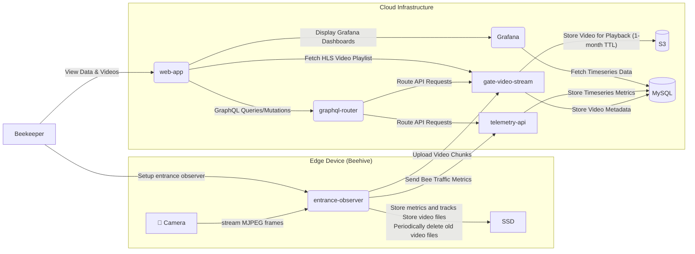
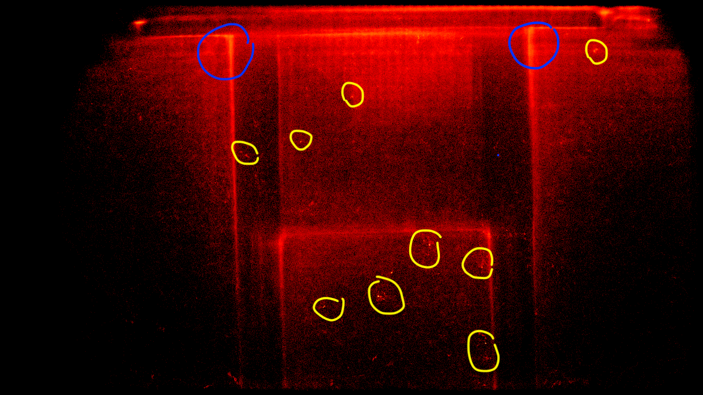
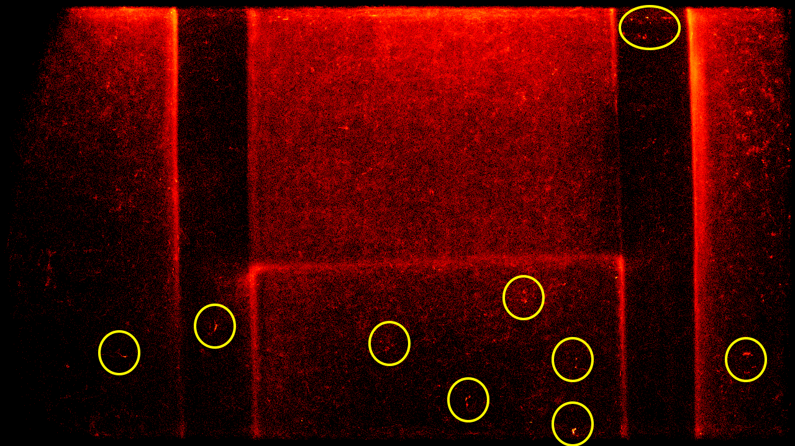
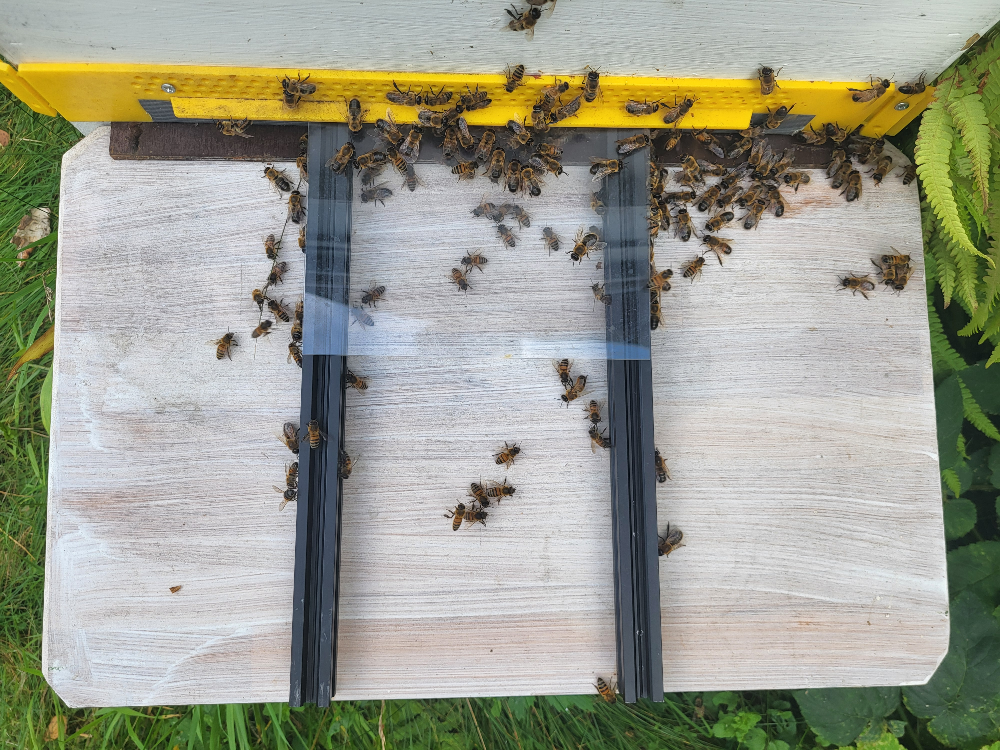

# Real-Time Analysis of Honey Bee Behavior with Gratheon's entrance-observer: A Computer Vision System for Tracking Forager Traffic and Movement Speed

## Abstract

Traditional beekeeping relies on manual inspections that are inefficient and stressful for bees. This paper introduces the **entrance-observer**, a non-invasive computer vision system for monitoring honey bee colonies. Deployed on an NVIDIA Jetson Orin Nano, the system uses a YOLOv8n model to analyze 4K video of the hive entrance in real-time. It tracks individual bees to gather metrics on forager traffic and introduces bee movement speed as a novel proxy for colony health. Data is aggregated in the cloud for long-term analysis and correlation with environmental factors. The system provides nuanced data on complex behaviors such as orientation flights, swarming, and robbing, offering beekeepers actionable insights into pollination efficiency and forager loss. Furthermore, it creates a foundational video dataset for developing future drone bee, bee pose, bee interaction and potentially varroa mite-infected bee detection models. This paper details the system's architecture, methodology, and preliminary findings, presenting a practical and scalable solution to key challenges in modern beekeeping.


## 1. Introduction

Honey bees (Apis mellifera) are essential for global food security, yet beekeepers face immense challenges in maintaining healthy colonies. Traditional beekeeping is characterized by unscalable work that relies on frequent, time-consuming, and physically demanding manual inspections. Beekeepers must make critical decisions about colony health, but they often lack the up-to-date and correct information needed to do so effectively. A primary threat is the Varroa destructor mite, a parasite that can decimate a hive if not managed effectively. Traditional monitoring methods, such as manual inspections, are labor-intensive, stressful for the bees, and often fail to provide the timely data needed for effective intervention. While tools like hive scales can indicate changes in foraging activity, they do not offer insights into the underlying causes, such as disease, forager loss, or parasite load.

The limitations of existing methods highlight the need for more advanced, non-invasive monitoring solutions. The ability to automatically detect parasites like Varroa mites and other threats at an early stage would be a significant breakthrough for beekeepers, enabling them to apply targeted treatments only when necessary, thereby reducing chemical use and improving colony health. Furthermore, detailed monitoring of forager traffic can provide valuable information about pollination efficiency and the impact of environmental stressors, such as pesticides. This research focuses on solving several key problems for beekeepers through continuous video analysis:

*   **Foraging Activity Analysis:** Correlating forager traffic with weather and environmental conditions to assess colony productivity and growth through regular orientation flights.
*   **Pest and Predator Attacks:** Identifying attacks from hornets, wasps, or robbing bees from other hives.
*   **Seasonal Behavior Tracking:** Monitoring events like the seasonal expulsion of drones from the hive.
*   **Swarming Prevention:** Early detection of pre-swarming behaviors to prevent colony loss.
*   **Queen Health Monitoring:** Observing the swarm queen's initial mating flights.

This paper presents a practical methodology for beehive entrance monitoring that aims to address these challenges. We have developed a scalable system called the `entrance-observer`, which uses a camera and an AI model running on an edge device to continuously analyze bee activity. The `entrance-observer` is available as open-source software under the AGPL license at https://github.com/Gratheon/entrance-observer/. The system is designed not only to count bee traffic but also to analyze movement dynamics. We introduce bee movement speed on the landing board as a novel proxy for colony health, hypothesizing that a colony's activity level, represented by speed, is a sensitive indicator influenced by a wide array of factors. These include environmental conditions (e.g., sun presence, wind, humidity), resource availability (e.g., pollen), and internal or external stressors (e.g., Varroa mite infestation, pesticide exposure, hornet attacks, hive congestion). This serves as a platform for developing more advanced diagnostic tools, with a primary focus on the detection of Varroa mites and other parasites. This paper details the system's architecture, the methodology for its deployment and data collection, and discusses its potential to become a valuable tool for modern, sustainable beekeeping.

### 1.1. Context: Smart Manufacturing in Beekeeping

The principles of Smart Manufacturing, which involve the deep integration of digital and physical processes for automated, data-driven production, are increasingly relevant beyond traditional factory settings. This paradigm can be extended to agriculture and apiculture, creating a vision for "Smart Beekeeping." As outlined by us before [21], a fully integrated smart apiary would combine various technologies—such as in-hive sensors for temperature and humidity, robotics for automated frame extraction, and cloud-based SaaS platforms for data analysis—to create a highly efficient and responsive beekeeping operation.

In this context, the `entrance-observer` system serves as a critical component: a non-invasive, real-time data acquisition module. It functions as the "eyes" of the smart hive, providing the continuous, event-driven data on bee behavior that is essential for the higher-level monitoring, forecasting, and automation central to the Smart Manufacturing concept. This paper focuses on the development and validation of this key vision-based module, which lays the groundwork for its integration into a larger, fully automated beekeeping ecosystem.

## 2. Related Work

The application of technology to beekeeping, often referred to as "precision beekeeping," has been a growing area of research. These technological approaches can be broadly categorized into two main groups: systems that rely on in-hive sensors and physical hardware to monitor colony conditions, and those that employ non-invasive computer vision to analyze bee behavior externally.

### 2.1. Sensor and Hardware-Based Monitoring

A significant body of work has focused on using sensors to monitor the internal conditions of the hive. These systems typically measure parameters such as temperature, humidity, and acoustics to infer the colony's state [5]. Another example of a sensor-based system is the work of Komasilovs et al. [6], who developed a modular hardware system for precision beekeeping. Their system uses a Raspberry Pi to collect data on temperature, weight, and sound from the hive, and a solar panel for power. The data is then sent to a cloud-based data warehouse for analysis, with the goal of helping beekeepers remotely identify different states of their colonies, such as swarming or colony death. This work is part of the SAMS project, a European Union-funded initiative to enhance international cooperation in sustainable agriculture. Another approach involves hardware-based counters at the hive entrance. The "2019 Easy Bee Counter" by Hudson [8], for example, is an open-source project that uses a custom-designed printed circuit board with infrared sensors to count bees passing through physical gates. While accessible for hobbyists, this method is intrusive and can be affected by environmental factors like sunlight or propolis buildup.


### 2.2. Vision-Based Monitoring

Computer vision has emerged as a powerful tool for non-invasive beehive monitoring, eliminating the need for intrusive hardware. Early work in this area often required marking bees or using RFID tags, but more recent approaches focus on tracking unmarked bees. Foundational research in this domain includes the work of Rodriguez et al., who demonstrated the effectiveness of Convolutional Neural Networks (CNNs) for the specific task of identifying pollen-bearing bees. In an early study, they systematically compared traditional machine learning classifiers against both shallow and deep CNNs, finding that a shallow CNN architecture achieved a high accuracy of 96.4%. Notably, this simpler model outperformed deeper networks like VGG16, highlighting the importance of model architecture in relation to specific, smaller datasets. This work also contributed one of the first public datasets of annotated bee images, fostering further research. Their later work [1] expanded on this by developing a more complex system using Part Affinity Fields (PAFs) for pose estimation, enabling more robust tracking and pollen detection on unmarked bees. Similarly, Marstaller et al. [2] proposed "DeepBees," a multi-task CNN architecture for genus identification, pollen detection, and pose estimation.


A major focus of vision-based research has been the detection of the *Varroa destructor* mite. Non-invasive approaches have explored hyperspectral imaging to improve the contrast between mites and bees [3], and the use of object detectors like YOLOv8 and SSD. Bilik et al. [4] found that training a model to detect "infected bees" as a class was more effective than detecting the mites themselves.

Some systems combine vision with other sensors in a hardware-centric design. The "Bee Health Monitor" [9], detailed further by Nevlačil et al. [10], is an open-source project that uses a Raspberry Pi to collect data from a camera, microphone, and various atmospheric sensors. However, this system requires bees to pass through 3D-printed tunnels to be monitored by the camera. This intrusive design, while allowing for close-up imaging, alters the bees' natural behavior at the entrance.

Another notable project is "BeeAlarmed" by Hickert [11], which also uses a Jetson Nano for vision-based analysis. The system uses a CNN to classify bees into several categories, including those carrying pollen, infested with Varroa mites, or exhibiting cooling behaviors. However, the "BeeAlarmed" hardware relies on a controlled, enclosed setup that funnels bees "under a roof" across a pane with a uniform green background and artificial lighting. This intrusive design, while simplifying the classification task, is sensitive to background and lighting variations and does not capture behavior in a natural context. In contrast, the `entrance-observer` is designed to be robust in natural, uncontrolled lighting conditions, tolerating shadows and changing sunlight. Furthermore, while "BeeAlarmed" focuses on static classification, the `entrance-observer` introduces novel dynamic metrics, such as the speed and interaction of bees on the landing board, offering a different and complementary dimension of behavioral analysis.

Beyond real-time monitoring systems, a significant area of research has focused on creating platforms to facilitate the large-scale annotation and analysis of video data. A key example is LabelBee [13], a web-based platform designed for the collaborative, semi-automated annotation of honeybee behavior. LabelBee provides a suite of tools for researchers to manually and automatically label events, track tagged individuals using AprilTags, and build high-quality datasets. This "human-in-the-loop" approach is invaluable for training and validating the complex models needed for behavior recognition. While systems like LabelBee are essential for the research and development phase, they differ from the `entrance-observer` in their primary function. LabelBee is a post-processing and analysis tool for creating datasets, whereas the `entrance-observer` is an edge-computing system designed for real-time, autonomous monitoring and data collection in a production apiary environment.

While the `entrance-observer` focuses on aggregate metrics of bee traffic and behavior, another significant challenge in vision-based monitoring is the long-term re-identification of individual unmarked bees. Research by Chan et al. (2022) has shown that this can be achieved by training deep learning models on large datasets. They demonstrated that self-supervised learning, using short-term tracks of bees as training data, is highly effective for building models that can re-identify individuals over multiple days. This highlights the potential of large-scale video datasets, like the one generated by `entrance-observer`, to serve as a foundation for developing such advanced capabilities.

The `entrance-observer` system presented in this paper builds upon this body of vision-based work but with a key distinction: it is designed to be completely non-invasive, practical, and easy to deploy. By monitoring the unmodified hive entrance, it captures more authentic behavioral data. It utilizes a state-of-the-art YOLOv8 model to address the key challenges of forager loss, pollination efficiency, and Varroa mite detection, aiming to be a practical tool for real-world apiaries.

## 3. System Architecture
### 3.1. Hardware

The hardware for the `entrance-observer` system is designed to be a powerful and robust platform for edge computing. The core of the system is an NVIDIA Jetson Orin Nano 8GB, a compact and powerful single-board computer with a GPU that is well-suited for running AI models.

The video data is captured by a Mokose 4K USB camera, which is equipped with a 5-50mm varifocal lens. This combination allows for high-resolution video capture and the flexibility to adjust the field of view to suit different hive entrance configurations. The camera is mounted on an articulating arm, which allows for precise positioning.

### 3.2. Bill of Materials

The following table details the components used to build the `entrance-observer` system, along with their approximate costs as of September 2025.

| Component | Description | Price |
| --- | --- | --- |
| **Compute Module** | NVIDIA Jetson Orin Nano 8GB Developer Kit | $249.00 |
| **Display** | 7-inch Capacitive Touch Screen, 1024x600 | $47.99 |
| **Camera** | MOKOSE 4K@30fps USB Camera | $154.50 |
| **Camera Lens** | 5-50mm HD CCTV Lens, 3MP, Aperture F1.4 | €43.35 |
| **Storage** | SanDisk SSD Plus M.2 250GB NVMe SSD | €23.88 |
| **Connectivity** | Waveshare AC8265 Wireless NIC for Jetson Orin Nano | €22.92 |
| **Enclosure** | Acrylic Clear Case for NVIDIA Jetson Nano | €11.36 |
| **Camera Mount** | Security Wall Mount with 1/4 Screw Head | $9.59 |
| **3D-Printed Enclosure Cover** | Custom-designed protective cover | Self-printed |
| **Total** | | **~$461 + €101.51** |


### 3.3. Software
#### 3.3.1. entrance-observer application

The `entrance-observer` application is a Python-based software package that runs on the edge device. It is responsible for capturing video, processing it in real-time, and uploading the results to the cloud. The application is built using a modular architecture, with different components responsible for different tasks.

Logs of service startup:


The overall system architecture is composed of several microservices that work together to collect, process, and display the data from the beehive. However `entrance-observer` is self-sufficient and can collect and visualize data without cloud services. The following diagram illustrates the flow of data and the interactions between the different components:



The video processing pipeline is built using OpenCV. It captures frames from the camera, resizes them to a manageable resolution, and then passes them to two separate queues: one for video writing and one for AI processing. This multi-threaded approach ensures that the video capture process is not blocked by the computationally intensive AI processing.


entrance-observer video screenshot with Yolo model detections, entrance detection line and bee movement tracks. A ruler added for reference of the zoom level


#### Metrics

Bee detection and tracking is performed using a YOLOv8 model. The model has been pre-trained on a large dataset of bee images and is able to detect and track individual bees with a high degree of accuracy. The tracker assigns a temporary ID to each bee, allowing its movement to be followed throughout a single 30-second video chunk. It is important to note that these track IDs are not persistent and are reset with each new video chunk. The application uses this short-term tracking information to calculate a rich set of metrics over 30-second intervals, including:

*   **`bees_in` & `bees_out`**: These metrics are determined using a virtual horizontal line placed across the video frame. A bee is counted as "out" or "in" when the center of its tracked bounding box crosses this line. The direction of crossing determines whether the bee is entering or exiting. The system's logic can be inverted based on camera placement (e.g., above or below the entrance).
*   **`net_flow`**: The difference between `bees_in` and `bees_out`, indicating the net change in the number of bees in the hive over the interval.
*   **`avg_speed_px_per_frame`**: The average speed of all tracked bees, calculated as the mean Euclidean distance (in pixels) traveled by each bee between consecutive frames. This metric serves as a proxy for the overall activity level on the landing board.
*   **`p95_speed_px_per_frame`**: The 95th percentile of bee speeds. This metric is more robust to outliers than the average and may better represent the speed of actively foraging bees.
*   **`stationary_bees_count`**: The number of bees that are considered stationary. A bee is flagged as stationary if the total distance it travels within the 30-second video chunk is below a predefined threshold (10 pixels), indicating behaviors such as guarding or resting.
*   **`bee_interactions`**: The number of times bees come into close proximity with each other (within a 40-pixel threshold). This metric can be used to identify a variety of social behaviors, including guarding, food exchange (trophallaxis), or defensive actions against intruders.

The application also provides a local web UI, which is built using Flask. The web UI allows the user to view a live video feed from the camera, monitor the bee traffic statistics, and adjust the camera settings.

Graphs of metrics in entrance-observer UI from september 9:


#### 3.3.2. Gratheon web application

The Gratheon web application is a cloud-based platform that provides a centralized location for storing, visualizing, and analyzing the data from the `entrance-observer` devices. The web application provides a user-friendly interface (including a mobile app) that allows beekeepers to:

*   View video playback from their hives.
*   Monitor the bee traffic statistics in real-time.
*   Analyze historical data to identify trends and anomalies
*   Receive alerts and notifications about important events, such as a sudden drop in forager activity or a potential hornet attack.

The web application is designed to be a powerful tool for beekeepers, providing them with the information they need to make informed decisions about the management of their colonies.

Gratheon web-app showing hive management along with entrance section (box) and tied to it stream playbacks. Modular configuration allows to have multiple observable hive entrances, which is not so common.


## 4. Methodology
### 4.1. Experimental Setup

The experiment was conducted in a suburban apiary located in Tallinn, Estonia (Pirita-Kose district, Geo coordinates 59.436962 x 24.753574). The beehive used for the study was a 3-section vertical hive with Estonian frames, manufactured by Karlwood. The hive was positioned on four large bricks, with the entrance facing south-west, and was protected from the wind by a house wall on the eastern side.


The `entrance-observer` device was installed at the hive entrance, with the camera positioned above the entrance to provide a clear, top-down view of the bees. The camera was mounted on a "Security Camera Mount Bracket for Camera with 1/4 Screw Head Wall Mount," which allowed for precise and stable positioning. The NVIDIA Orin Nano was housed in a wooden enclosure on top of the hive, physically separated from the bees to avoid any disturbance. Power was supplied to the device via an extension cord connected to a standard 220V household outlet.

#### Challenges
During the setup process, several hardware and software challenges were encountered. 
- On the hardware side, the NVIDIA Jetson Orin Nano did not provide sufficient power to the Mokose 4K camera over USB3. An attempt to use an external powered USB hub resulted in the camera and several USB ports on the Jetson Orin Nano being damaged due to an incorrect voltage setting (12V instead of 5V). As a result, a backup camera had to be used, connected to the single remaining USB-C port, which limited the video capture to USB2 speeds. This hardware failure constrained the video resolution to 1280x720 and the frame rate to 15 FPS. 
- The Wi-Fi signal at the apiary was not strong enough for the Jetson Orin Nano to maintain a stable connection, so a TP-Link Wi-Fi extender was installed to boost the signal.
- On the software side, installing PyTorch with GPU support on the Jetson Orin Nano proved to be a significant hurdle. To overcome the PyTorch dependency issues, a Docker-based approach was adopted, using the official Ultralytics Docker image. While this solved the dependency issues, it also meant that a native Python UI could not be used. Consequently, a web-based UI was developed to provide a way to preview the results and configure the system.
- Furthermore, initial attempts on September 3rd to implement a high-performance, GPU-accelerated video capture pipeline using GStreamer were unsuccessful. This effort was hampered by persistent "Argus" errors related to the camera drivers and the discovery that the Jetson Orin Nano's hardware does not include a dedicated h264 encoder chip. This limitation prevented efficient, high-resolution video compression on the device. Consequently, this approach was abandoned in favor of a less efficient, purely software-based video capture method using OpenCV, which contributed to the constraints on frame rate and resolution. This experience suggests that alternative hardware, such as an Apple Mac Mini or a newer NVIDIA Jetson model with more robust multimedia encoding capabilities, could be a more viable option for future iterations.
- Docker Build Failures and Disk Space Exhaustion: A significant challenge was encountered during the Docker build process on the Jetson Orin Nano. The build would consistently fail with a "no space left on device" error. This was traced back to the `COPY . .` instruction in the `Dockerfile`, which was attempting to copy the entire project directory, including gigabytes of recorded video files (`videos/`, `remote-videos/`), into the Docker image. This bloated the build context to over 27GB, exceeding the available disk space. The issue was resolved by creating a `.dockerignore` file in the project's root directory. 


#### Remote access
For connectivity, the system initially relied on a local area network (LAN) over WiFi for remote access via SSH and a web interface. This was later upgraded to Tailscale, a commercial VPN solution, which enabled secure remote monitoring and video file downloads from any location, facilitating off-site system checks and data retrieval.

Remote desktop access was also explored using VNC (Virtual Network Computing). While previous experiments with a Jetson Nano (a different device) had been successful using RealVNC, this approach failed with the Jetson Orin Nano. A connection could be established, but no graphical user interface was displayed, rendering it unusable for remote control. Future iterations may explore web-based VNC solutions like noVNC, inspired by its successful implementation in other robotic remote lab environments [6].

Jetson Nano VNC:


Jetson Orin Nano VNC:


### 4.2. Data Collection

Data collection began on September 4th and is ongoing, with the goal of capturing approximately two weeks of data before the onset of cold weather. Data collection is not uniform as we were changing the system, had to periodically maintain and resolve ongoing issues. The `entrance-observer` application is configured to record video in 30 second chunks, covering the full daylight hours.

The raw video files are periodically synchronized from the Jetson Orin Nano to a remote machine for backup and further analysis using a shell script that leverages `rsync`. This script runs in a continuous loop, ensuring that the video data is efficiently and reliably transferred over the Wi-Fi network.


Example of metrics dataset in JSONL format:
```
{"timestamp": "2025-09-06T05:03:54.564032", "metrics": {"bees_in": 0, "bees_out": 0, "detected_bees": 37, "avg_speed_px_per_frame": 3.39, "p95_speed_px_per_frame": 6.43, "stationary_bees_count": 4, "net_flow": 0}}
{"timestamp": "2025-09-06T05:04:24.770983", "metrics": {"bees_in": 0, "bees_out": 0, "detected_bees": 26, "avg_speed_px_per_frame": 4.7, "p95_speed_px_per_frame": 9.65, "stationary_bees_count": 2, "net_flow": 0}}
{"timestamp": "2025-09-06T05:04:54.738219", "metrics": {"bees_in": 0, "bees_out": 0, "detected_bees": 41, "avg_speed_px_per_frame": 3.82, "p95_speed_px_per_frame": 7.99, "stationary_bees_count": 6, "net_flow": 0}}
{"timestamp": "2025-09-06T05:05:24.636856", "metrics": {"bees_in": 0, "bees_out": 0, "detected_bees": 30, "avg_speed_px_per_frame": 3.51, "p95_speed_px_per_frame": 8.82, "stationary_bees_count": 1, "net_flow": 0}}
```


Example of a single entry (tracks of individual bees per frame within 30 sec video chunk) of tracks dataset in JSONL format (~40-50MB per day):
```
{"timestamp": "2025-09-06T05:01:54.546608", "frame_dimensions": {"height": 720, "width": 1280}, "track_history": {"38": [[1150, 45], [1156, 44], [1160, 43], [1162, 42], [1165, 41], [1170, 41], [1172, 44], [1175, 37], [1182, 40], [1188, 40]], "40": [[1099, 49], [1098, 49], [1099, 49], [1099, 49], [1098, 48], [1098, 49], [1098, 49], [1098, 49], [1098, 49], [1098, 49], [1098, 49], [1098, 49], [1098, 49], [1099, 49], [1098, 49], [1098, 49], [1098, 49], [1098, 49], [1098, 49], [1098, 50], [1098, 49], [1098, 49], [1098, 49], [1098, 49], [1094, 49], [1094, 49], [1094, 49], [1094, 49], [1094, 49], [1094, 49], [1095, 49], [1097, 49], [1097, 49], [1097, 50], [1098, 50], [1099, 51], [1100, 51], [1101, 51], [1102, 49], [1104, 48], [1102, 48], [1103, 47], [1103, 46], [1104, 44], [1104, 44], [1103, 45], [1103, 44], [1103, 44], [1103, 45], [1102, 45], [1101, 46], [1101, 46], [1102, 46], [1102, 45], [1102, 46]], "44": [[1162, 25], [1163, 25], [1163, 25], [1160, 23], [1157, 23], [1158, 21], [1158, 22], [1156, 22], [1153, 23], [1153, 25], [1152, 22], [1151, 21], [1150, 20], [1149, 26], [1148, 29], [1145, 27], [1140, 27], [1143, 26], [1145, 26], [1144, 33], [1146, 32], [1148, 32], [1147, 31], [1144, 31], [1143, 30], [1145, 32], [1145, 33], [1146, 34], [1145, 33], [1145, 33], [1143, 31], [1141, 32], [1142, 32], [1150, 37], [1147, 36], [1147, 36], [1144, 37]], "46": [[1133, 33], [1136, 34], [1140, 34], [1143, 35], [1146, 34], [1148, 34], [1151, 33], [1153, 33], [1150, 32], [1149, 32], [1149, 31], [1149, 30], [1150, 30], [1150, 31], [1150, 31], [1151, 31], [1152, 33], [1153, 34], [1154, 34], [1155, 34], [1156, 34], [1157, 35], [1159, 35], [1160, 35], [1161, 35], [1164, 35], [1164, 35], [1165, 35], [1167, 35], [1170, 35], [1172, 34], [1175, 35], [1177, 36], [1180, 36], [1182, 36], [1184, 36], [1187, 36]], "48": [[473, 20], [474, 19], [473, 19], [473, 19], [474, 19], [474, 19], [474, 19], [474, 18], [474, 18], [474, 19], [473, 19], [471, 19], [472, 19], [472, 19], [473, 19], [474, 20], [473, 20], [472, 20], [472, 21], [473, 22], [472, 22], [472, 22], [472, 21], [472, 21], [471, 21], [471, 21], [471, 20], [471, 21], [471, 21], [472, 21], [471, 20], [471, 20], [470, 19], [470, 20], [470, 20], [471, 19], [472, 19], [472, 20], [474, 19], [474, 19], [475, 19], [475, 19], [474, 20], [475, 20], [476, 20], [474, 21], [474, 20], [473, 20], [473, 19], [474, 20], [473, 20], [474, 22]], "50": [[755, 70], [755, 78]], "51": [[737, 131], [739, 130], [736, 135], [739, 137]], "52": [[510, 26], [514, 26]], "53": [[557, 22], [559, 23], [561, 23], [568, 22], [572, 22], [575, 23], [580, 24], [583, 24], [587, 24], [589, 24], [591, 23], [594, 23], [595, 23], [597, 22], [599, 22], [601, 22], [602, 22], [603, 21], [604, 21], [605, 21], [606, 22], [607, 21], [608, 20], [611, 20], [615, 20], [617, 21], [620, 20], [622, 20], [624, 19], [625, 18], [629, 18], [633, 19], [634, 18], [632, 18], [632, 18], [633, 17], [633, 17], [634, 17], [634, 17], [635, 17], [636, 18], [635, 18], [636, 18], [640, 18], [642, 18], [643, 20], [645, 20], [646, 20], [648, 21], [648, 21], [650, 22], [651, 22], [652, 21], [655, 22], [659, 21], [663, 21], [668, 22], [674, 21], [678, 21], [679, 20], [679, 20], [680, 20], [682, 20], [683, 20], [683, 19], [685, 18], [688, 17], [688, 17], [691, 18], [692, 19], [693, 19], [696, 19], [696, 19], [696, 19], [694, 19], [693, 20], [693, 20], [692, 22], [692, 22], [695, 21], [697, 20], [700, 19], [703, 19], [705, 18], [711, 20], [714, 19], [716, 20], [721, 20], [724, 20], [725, 20], [723, 19], [720, 20], [719, 19], [717, 20], [716, 21], [715, 23], [714, 24], [718, 32], [718, 38], [717, 42], [715, 47], [711, 53], [710, 53], [709, 54], [707, 54], [705, 54], [703, 54], [701, 55], [699, 55], [696, 56], [692, 56], [687, 57], [684, 57], [682, 57]], "55": [[743, 81]]}}
```


#### 4.2.2 Correlating data with weather and plant blooming factors
In addition to the video data, historical weather data for the apiary's location is being collected from the Open-Meteo API (`archive-api.open-meteo.com`). This data includes a wide range of meteorological variables, such as solar radiation, wind speed and gust, cloud cover, precipitation, atmospheric pressure, and air pollution (PM2.5 and PM10).


### 4.2.3. Dataset Availability

The video datasets collected during this research are publicly available at [https://gratheon.com/research/Datasets](https://gratheon.com/research/Datasets). The collection includes the following:


#### Dataset type 1
Zoom at landing board ~ 40cm wide. Camera placed on **third** hive section

- [September 04](https://drive.google.com/drive/folders/1BY7RrQdQI-6iaSzx4-CVES0kwVlpzX2u?usp=drive_link). 
	- some chunks have pairs with `_detect.mp4` suffixes, showing yolov8 model detections.
	- 5-25mb per chunk. mp4
- [September 05](https://drive.google.com/drive/folders/12oV370f8HqrZsuXUU9mLWeT9NAs8HcO2?usp=drive_link) 
	- Dataset duration ~8h (11:30 - 20:00 EEST)
	- Sunny weather.
	- ~ 25GB in total
	- 1280x720px. 30 min chunks. 15FPS. 5-25mb per chunk. mp4
	- file names are in UTC timestamps.
	- [metrics in jsonl format](https://drive.google.com/file/d/18b2aKTxrS1K9YpQciDybXwDlNYuEE4yh/view?usp=drive_link)
	- [bee tracks in jsonl format](https://drive.google.com/file/d/1J6I2KOeUa4dns7OmXidvc6Oqc0VF2goC/view?usp=drive_link)
- [September 6th](https://drive.google.com/drive/folders/1TQxpUFSc13xWLE_0gA4BkzPv8amcFyc-?usp=drive_link). Sunny weather. 
	- Dataset duration ~8h (8:00-15:36, 19:35-20:35 EEST)
	- ~13:20 a flight pattern is seen
	- [metrics in jsonl](https://drive.google.com/file/d/1oHRftj_zvbZXd8vKCcTIg9VRGoslf4vy/view?usp=drive_link)
	- [bee tracks in jsonl](https://drive.google.com/file/d/1SibnVr5I8ifYLJlxiqiWBpNWbBxm7lEl/view?usp=drive_link)


#### Dataset type 2
**New zoom level** of landing board area (23cm wide). Camera placed on **third** hive section

- [September 7th](https://drive.google.com/drive/folders/1E8p_d_rdb_Mq2IjoOyw4OVaWrs37xj2s?usp=drive_link)
	- Dataset duration ~ 3h (12:00-15:05 EEST)
	- 1280x720px. 30 min chunks. 15FPS.  
	- Sunny weather with clouds and gust after 16:00
	- [metrics](https://drive.google.com/file/d/1vzIe7SRJP_jarai9jqNIVPac8l6efrQv/view?usp=drive_link)
	- [tracks](https://drive.google.com/file/d/1ij0A15NC2XDdUy3ghvZ6GYT_458uqzZn/view?usp=drive_link)
- September 8th
	- [metrics](https://drive.google.com/file/d/1Uz0I-nzvRPiNe1QH-PK1XcPpCMrfV2NY/view?usp=drive_link)
	- [tracks](https://drive.google.com/file/d/1o9Z6c7-JunYptKTGUFV7aJqYdjkKKYUr/view?usp=drive_link)
- September 9th

#### Dataset type 3
Camera placed on **second** hive section (closer), changed zoom, **removed the glass** and aluminium boundaries, added stones instead.
Counting line moved closer to the hive entrance.

- September 10th


This collection of annotated video and corresponding metrics serves as a valuable resource for the research community. It can be used not only to replicate the findings of this study but also as a foundational dataset for training and validating new models. Potential applications include improving bee detection precision under diverse conditions (e.g., varying zoom levels, lighting, and shade) and developing classifiers to distinguish between different bee activities, such as flying versus walking.


### 4.2.4. AI Model Training

The bee detection model was trained using the YOLOv8n architecture, chosen for its optimal balance of speed and accuracy on edge devices like the NVIDIA Jetson Orin Nano. The training was conducted in the Google Colab environment, leveraging its cloud-based GPU resources (NVIDIA T4).

The model was trained on the "Bees on Hive Landing Boards" dataset [15], which was sourced from Roboflow. This dataset, created by Sledevičius and Matuzevičius, consists of 14,199 training images, 1,353 validation images, and 676 test images. A key feature of their work is the focus on capturing images of beehive entrances with native landing boards, without artificial backgrounds, which aligns with the non-invasive approach of the `entrance-observer`. The training data was augmented with three outputs per training example, using techniques such as rotation (between -15° and +15°), brightness adjustments (between -15% and +15%), and exposure adjustments (between -10% and +10%) to improve the model's robustness.

After 25 epochs of training, the model achieved a mean Average Precision (mAP50-95) of 0.77 on the validation set, demonstrating a high of accuracy in detecting bees. The initial weights for the YOLOv8n model and training methodology were adapted from the 'Counting bees with the LABRADOR board' project by Marcelo Rovai [8], which provided a strong foundation for our bee detection model.

From empirical observations, model quality is good when running detections on homogeneous surface with only bees being present. 

However in more complex scenes, it is prone to have false positive detections, for example when running app from Mac OSX:


### 4.3. Data Analysis

The data analysis pipeline is designed to provide both real-time insights and in-depth, long-term scientific investigation. The process begins at the edge, where the `entrance-observer` application processes video in 30-second chunks, as configured by the `VIDEO_CHUNK_LENGTH_SEC` environment variable. For each chunk, the system calculates the bee traffic metrics described in Section 3.2.1. These metrics are then transmitted to the Gratheon web application's telemetry API.

Each 30-second aggregation of metrics is stored as a distinct `EntranceMovementRecord` in a MySQL database, linked to its corresponding hive and section ID. This granular, time-stamped data structure provides a rich dataset for detailed analysis. The metrics stored for each interval include `bees_in`, `bees_out`, `net_flow`, `avg_speed_px_per_frame`, `p95_speed_px_per_frame`, `stationary_bees_count`, and `detected_bees`.

The second stage of the analysis focuses on correlating the bee traffic data with the historical weather data. While the Gratheon web application provides real-time visualization of these correlations through **Grafana dashboards**, a more rigorous statistical analysis will be performed to quantify the relationships between bee behavior and environmental factors. The planned statistical methods include:

*   **Descriptive Statistics:** Basic descriptive statistics (mean, median, standard deviation) will be calculated for all bee traffic metrics to summarize the overall activity patterns.
*   **Correlation Analysis:** A Pearson correlation analysis will be conducted to determine the strength and direction of the linear relationship between bee activity metrics (e.g., `bees_out`, `net_flow`) and key weather variables (e.g., temperature, solar radiation, wind speed).
*   **Time-Series Analysis:** The bee traffic data will be treated as a time series to identify and model temporal patterns, such as diurnal cycles. This analysis will also be instrumental in establishing a baseline for normal activity, which is a prerequisite for anomaly detection.
*   **Regression Analysis:** Multiple regression models will be developed to predict bee activity levels based on a combination of weather variables. This will help to identify the most significant environmental drivers of foraging behavior.

#### Spatial heatmap analysis
In addition to statistical analysis, we use visualization techniques to explore the spatial patterns of bee movement. A heatmap of bee traffic on the landing board was be generated from the `track_history` data. This visualization reveals the most frequented areas, providing insights into the bees' preferred paths and loitering zones. 

The heatmasp for the track data collected on September 6th and 9th as examples are shown below. Notice that there are clearly visible hot spots (highlighted in yellow) of stationary bees, we're assuming these are defenders, spread out and positioned in the landing area.

The aluminium-glass construction designed to prolong bee movement for better counting and tracking also shows some of the inefficiencies - bees avoid cold metal, and they do spend too much time on top of the glass falsely assuming they can enter somewhere on top.

Thery also are present adjacent to hive entrance angles (highlighted in blue) where partial entry under aluminium frame was possible too at the beginning on 6th of september and later on 9th when they collectively cleared out the entrance.

They also tend to like to be in the corners, possibly because it offers some area of protection from the wind or potential preditors.

Also notice that glass border is also noticeable, because bees could move on it upside-down and flip on the other side.





#### Grafana UI for correlation detection


Beehive activity metrics (stored in mysql, queried via graphql API through telemetry-api) in Grafana for September 8th (time in UI is in EEST):


Details connecting grafana to backend GraphQL API that uses telemetry-api. Notice using sending currently selected time range as arguments and parsing output


Based on these analyses, we will test several specific hypotheses. We posit that bee movement speed and overall traffic are complex variables influenced by multiple factors. Our primary hypotheses include:
1.  **Environmental Drivers:** There is a significant positive correlation between ambient temperature (above a certain threshold), solar radiation, and the number of outgoing bees (`bees_out`). Conversely, increased wind speed, humidity, and precipitation are significantly correlated with a decrease in overall bee traffic.
2.  **Colony Stressors:** The presence of stressors such as Varroa mite infestation, pesticide exposure, or predator attacks (e.g., hornets) will lead to a measurable decrease in the average and 95th percentile of bee movement speed (`avg_speed_px_per_frame` and `p95_speed_px_per_frame`).
3.  **Internal Hive Conditions:** Factors such as hive placement, orientation, and insufficient internal space (congestion) will correlate with changes in landing board activity, potentially affecting `stationary_bees_count` and `bee_interactions`.

Finally, we will develop a strategy for anomaly detection based on statistical deviations from the established baseline of normal activity. An anomaly will be defined as a data point that falls outside a specified number of standard deviations from the predicted value, given the time of day and prevailing weather conditions. This will enable the system to flag unusual events that may require the beekeeper's attention.

### 4.4. Experimental Log

**September 5, 2025:**
- System running and collecting data.

**September 6, 2025:**
- Work was completed to integrate Grafana dashboards into the web application.
- Fixed **telemetry-api** to accept new set of metrics and configured Grafana to visualize them.

**September 7, 2025:**
- **Camera Field of View Adjustment:** The camera's varifocal lens was adjusted to narrow the field of view from ~40 cm to ~23 cm to increase pixel density per bee for future mite detection experiments.
- **Landing Board Construction Improvement:** Gaps near the entrance were sealed to ensure more accurate forager counts.
- **Note on Data Consistency:** It is acknowledged that these changes will significantly alter the bee traffic metrics. Data collected from this point forward is not directly comparable to the data from September 4-6.

**September 8, 2025:**
- System running and collecting data.


## 5. Results and Discussion

The data collection for this study is currently ongoing, and a comprehensive analysis will be performed once a sufficient dataset has been gathered. However, based on the methodology outlined in Section 4.3, we can anticipate the nature of the expected results and their potential implications.

The primary goal of the data analysis is to move beyond simple bee counting and to model the complex interplay between bee behavior and environmental factors. We expect the statistical analyses to confirm our primary hypotheses. Specifically, we anticipate a strong positive correlation between bee activity (particularly `bees_out` and `net_flow`) and favorable weather conditions, such as higher temperatures and solar radiation. Conversely, we expect to find a negative correlation with adverse conditions like high wind speeds and precipitation.

The results will be presented through a combination of statistical summaries and visualizations. Time-series plots will be used to illustrate the diurnal patterns of bee activity and their relationship with weather variables. Scatter plots with regression lines will visually represent the correlations between specific metrics, and heatmaps will be employed to visualize activity patterns across different times of day and days of the week.

The findings from this study are expected to have several practical implications for beekeepers. By quantifying the relationship between bee behavior and the environment, we can establish a baseline for normal colony activity under various conditions. This baseline will be crucial for the development of an effective anomaly detection system. The ultimate goal is to create a system that automatically identifies significant events and notifies the beekeeper, enabling them to intervene only when necessary.

### 5.1. Behavioral Observations

Initial observations have already demonstrated the system's potential for detailed behavioral analysis. The following are specific events captured by the system:

#### Orientation Flights
On September 6th, a significant increase in bee presence was noted around 13:20, which is characteristic of orientation flights for young bees. Although this event occurred before Grafana integration was complete, analysis of the raw metrics revealed a sharp spike in the `detected_bees` count, reaching 672 at 12:34 UTC. This demonstrates that the `detected_bees` metric can serve as a powerful indicator for identifying large-scale events where a high volume of bees congregates at the hive entrance.

#### Hive Defense and Robbing Attempts
The system documented several instances of hive defense. For example, on September 5th, video footage [1757061346.mp4](https://drive.google.com/file/d/1XlvomCMDlMO597fmywlT0nY95bIqBYCt/view?usp=drive_link) captured a clear instance of two guard bees intercepting an intruder and physically "escorting" it away from the entrance. The ability to automatically detect and catalog such events provides direct insights into colony defensiveness and resource competition.


#### Seasonal Drone Expulsion
On September 7th, the system recorded the seasonal expulsion of drones. The video footage captured numerous drones being denied entry to the hive by worker bees, which were observed actively blocking, dragging, and even attacking the drones' wings. This complex social behavior is a key indicator of the colony's preparation for winter and is precisely the type of event that can only be reliably captured through continuous video monitoring.

Drone congestion on top of the plexiglass, mostly immobile. In next days, dead drones were seen on the landing board.


#### Wasps
On 10th of September in `1757487957.mp4` at ~10:05 a wasp is seen freely entering the hive


#### Cooperative Behavior
On September 9th, a unique instance of social behavior was captured. A bee was observed struggling at approximately 13:45, apparently entangled in a blade of grass near the entrance. Several other bees were recorded approaching the distressed bee, seemingly assisting in its efforts to get free. This type of cooperative behavior, while known to exist, is difficult to capture and quantify. The ability of the `entrance-observer` to record such nuanced interactions highlights its value not just for tracking traffic, but for documenting complex social dynamics that could be correlated with overall colony health and cohesion.


Furthermore, the detailed analysis of forager traffic will provide insights into pollination efficiency. By understanding how environmental factors influence foraging, beekeepers can make more informed decisions about hive placement and management to maximize pollination services.

While the current focus is on the relationship between bee traffic and weather, the high-resolution data being collected will also serve as a valuable resource for future research. The detailed bee tracks, for example, could be used to train models to differentiate between different types of flights (e.g., foraging, orientation, cleansing) or to detect subtle behavioral changes that may be indicative of stress or disease. This rich dataset is a critical first step towards the ultimate goal of developing a comprehensive, non-invasive beehive monitoring system that can provide beekeepers with a deep understanding of their colonies' health and productivity.

## 6. Future Work

The `entrance-observer` system provides a robust foundation for non-invasive beehive monitoring, but the true potential of this technology lies in expanding its analytical capabilities. Our future work is structured around two key pillars: enhancing detection metrics and improving the hardware and software platform.

### 6.1. Enhancing Detection Metrics

The immediate priority is to move beyond bee counting and basic motion analysis to the detection of specific, high-value indicators of colony health and social behavior. This involves training and deploying more sophisticated computer vision models capable of identifying:

*   **Varroa Mites:** The detection of Varroa mites on bees is the most critical next step. This will require a high-resolution video dataset and a model trained to identify these small parasites. The ability to automatically quantify mite infestation levels would be a significant breakthrough for beekeepers, enabling targeted and timely treatments.
*   **Pollen-Carrying Bees:** Identifying bees returning to the hive with pollen is a direct indicator of foraging success and resource availability. This metric can provide valuable insights into pollination efficiency and the impact of environmental factors on foraging.
*   **Queen and Drones:** Differentiating the queen and drones from worker bees will allow for the monitoring of key colony events, such as the queen's mating flights and the seasonal expulsion of drones.
*   **Social Interactions:** Developing models to recognize and quantify social behaviors is a key area for future research. This includes detecting defensive actions against intruders, observing food exchange (trophallaxis), identifying hive "bearding" (bees congregating outside the entrance due to heat or overcrowding), and monitoring fanning behavior for hive ventilation.

### 6.2. Hardware and System Improvements

To support these enhanced detection capabilities, several hardware and system improvements are necessary:

*   **Upgraded Camera and GPU:** A 4K camera with a high frame rate (60 FPS) is essential for capturing the fine details required for mite detection. This must be paired with a more powerful GPU to handle the increased computational load of running multiple, complex models in real-time.
*   **Weatherproof Enclosure:** A robust, weatherproof enclosure with integrated LED lighting is needed to ensure consistent image quality and protect the hardware from the elements.
*   **Developer-Friendly Platform:** Given the challenges encountered with the Jetson Orin, we are considering a more developer-friendly platform, such as a Mac Mini, to accelerate development and deployment.

### 6.3. Advanced Model Architectures and Pose Estimation

While YOLOv8n provides a strong baseline for real-time detection, future work will explore more advanced model architectures to enhance the system's analytical depth. The goal is to move towards open-ended detection that can identify a wider range of objects and behaviors without extensive retraining for each new class.

One promising direction is the use of transformer-based models. Research such as BeeNet [16] has demonstrated that a combination of CNNs for feature extraction and a transformer encoder-decoder architecture can achieve high accuracy in fine-grained classification tasks, including bee species identification and health monitoring. However, it is worth noting that the authors of the BeeNet paper did not provide a public code repository, which makes it difficult to verify their findings and build upon their work. Nevertheless, the paper provides a valuable theoretical framework for the application of transformer-based models to bee monitoring. Adopting a similar approach could allow the `entrance-observer` to learn more complex visual features and perform more nuanced classifications, such as identifying different castes of bees or subtle indicators of disease.

Furthermore, to gain a deeper understanding of bee-to-bee interactions and individual movement, we plan to integrate pose estimation. By tracking the keypoints of a bee's body, we can more accurately determine its orientation and direction of movement. This would significantly improve the accuracy of metrics like `bees_in` and `bees_out` and provide a richer dataset for analyzing complex social behaviors like trophallaxis or guarding. An initial exploration of this concept was conducted using the `beepose` library [17], and while the library is now outdated, it serves as a proof-of-concept for the value of pose estimation in this domain. We are also aware of the `apic-bee-pose-dataset` [19], but its license does not permit commercial use, which is a consideration for the future development of the `entrance-observer` system.

Finally, we will continue to evaluate the rapidly evolving landscape of object detection models optimized for edge devices. Models such as YOLOv10, which offers NMS-free training for lower latency, and RT-DETR, an end-to-end DETR variant, present compelling alternatives that could further improve the efficiency and accuracy of the `entrance-observer` on hardware like the NVIDIA Jetson series. We also performed preliminary experiments with Large Language and Vision Assistant (LLaVA) models [18], but found that their empirical precision for the specific task of bee detection was not as high as that of convolutional networks like YOLO.

A primary goal for future work is to move from tracking bee populations to re-identifying individual bees over extended periods. The extensive `track_history` dataset generated by our system is ideally suited for this task. Following the methodology proposed by Chan et al. [20], we plan to use this data to train a re-identification model using self-supervised contrastive learning. This would enable us to track the foraging lifetime of individual bees, measure forager loss with high precision, and gain deeper insights into the division of labor within the colony.

Furthermore, we plan to explore multimodal analysis by integrating audio data with the existing video stream. The distinct sound produced by drones, for example, could be used in conjunction with video to create a more robust drone detection system. Combining these data streams could lead to the development of models that capture a richer, more dynamic understanding of hive activity.

The video dataset collected in this study is a critical first step towards these goals. By laying the groundwork for advanced parasite detection and behavioral analysis, we are moving towards a future where technology can help beekeepers manage their colonies more effectively and sustainably.

## 7. Conclusion

This paper has presented a practical methodology for monitoring beehive entrances using a powerful combination of computer vision and IoT technology for real-time data collection and cloud-based analysis. The `entrance-observer` system, built on an NVIDIA Jetson Orin Nano and a 4K USB camera, provides a non-invasive way to collect high-resolution data on bee behavior. The accompanying Gratheon web application offers a user-friendly platform for visualizing and analyzing this data for long-term observation and comparison.

The system is designed to address some of the most pressing challenges in modern beekeeping, including forager loss, pollination efficiency, and the detection of Varroa mites. By providing beekeepers with real-time, actionable insights into their colonies, the `entrance-observer` has the potential to improve colony health, increase productivity, and make beekeeping more sustainable.

While the data collection for this study is still ongoing, the preliminary results are promising. The system has already demonstrated its ability to detect subtle changes in bee behavior, and the planned analysis of the relationship between bee activity and weather data is expected to yield valuable insights.

It is important to acknowledge the limitations of the current system. The practical value of simply counting bees is limited. The true potential of this technology lies in its ability to detect parasites and other threats. The current camera resolution and frame rate may not be sufficient for reliable Varroa mite detection. Furthermore, the identification of individual unmarked bees remains a significant challenge.

The future work outlined in this paper, focused on enhancing detection metrics, represents a clear path towards overcoming these limitations. The ultimate goal is to create a system that is not just a "toy" for researchers, but a practical and affordable tool that can make a real difference to the health and productivity of bee colonies.

## 8. References

[1] Rodriguez, I. F., Chan, J., Alvarez Rios, M., Branson, K., Agosto-Rivera, J. L., Giray, T., & Mégret, R. (2022). [Automated Video Monitoring of Unmarked and Marked Honey Bees at the Hive Entrance](https://gratheon.com/research/papers/%E2%AD%90%EF%B8%8F%20Automated%20Video%20Monitoring%20of%20Unmarked%20and%20Marked%20Honey%20Bees%20at%20the%20Hive%20Entrance). *Frontiers in Computer Science*, 3, 769338. 

[2] Marstaller, J., Tausch, F., & Stock, S. (2019). [DeepBees – Building and Scaling Convolutional Neuronal Nets For Fast and Large-scale Visual Monitoring of Bee Hives](https://gratheon.com/research/papers/%E2%AD%90%EF%B8%8F%20DeepBees%20%E2%80%93%20Building%20and%20Scaling%20Convolutional%20Neuronal%20Nets%20For%20Fast%20and%20Large-scale%20Visual%20Monitoring%20of%20Bee%20Hives). In *Proceedings of the IEEE/CVF International Conference on Computer Vision Workshops*.

[3] Bielik, S., & Bilík, Š. (2025). [Towards Varroa destructor mite detection using a narrow spectra illumination](https://gratheon.com/research/papers/Towards%20Varroa%20destructor%20mite%20detection%20using%20a%20narrow%20spectra%20illumination). *arXiv preprint arXiv:2504.06099*.

[4] Bilik, S., Kratochvila, L., Ligocki, A., Bostik, O., Zemcik, T., Hybl, M., ... & Zalud, L. (2021). [Visual Diagnosis of the Varroa Destructor Parasitic Mite in Honeybees Using Object Detector Techniques](https://gratheon.com/research/papers/Visual%20Diagnosis%20of%20the%20Varroa%20Destructor%20Parasitic%20Mite%20in%20Honeybees%20Using%20Object%20Detector%20Techniques). *Sensors*, 21(8), 2764.

[5] Kulyukin, V. (2021). [Audio, Image, Video, and Weather Datasets for Continuous Electronic Beehive Monitoring](https://gratheon.com/research/papers/Audio,%20Image,%20Video,%20and%20Weather%20Datasets%20for%20Continuous%20Electronic%20Beehive%20Monitoring). *Applied Sciences*, 11(10), 4632.

[6] Komasilovs, V., Zacepins, A., Kviesis, A., Fiedler, S., & Kirchner, S. (2019). Modular sensory hardware and data processing solution for implementation of the precision beekeeping. *Agronomy Research*, 17(2), 509-517.

[7] Krūmiņš, D., Schumann, S., Vunder, V., Põlluäär, R., Laht, K., Raudmäe, R., Aabloo, A., & Kruusamäe, K. (2024). Open Remote Web Lab for Learning Robotics and ROS With Physical and Simulated Robots in an Authentic Developer Environment. *IEEE Transactions on Learning Technologies*, 17.

[8] Reis, J. A., & Ferreira Filho, J. A. (2023). Counting bees with the LABRADOR board. *GitHub repository*. Retrieved from https://github.com/Mjrovai/Bee-Counting/

[9] Hudson, T. (2019). *2019 Easy Bee Counter V.1*. Instructables. Retrieved from https://www.instructables.com/Easy-Bee-Counter/

[10] Boortel, T., et al. (2023). *Bee Health Monitor*. GitHub repository. Retrieved from https://github.com/boortel/Bee-Health-Monitor/

[11] Nevlačil, J., Bilík, Š., & Horák, K. (2023). Raspberry Pi Bee Health Monitoring Device. *arXiv preprint arXiv:2304.14444*.

[12] Hickert, F. (2020). *BeeAlarmed*. GitHub repository. Retrieved from https://github.com/BeeAlarmed/BeeAlarmed

[13] Rodriguez, I. F., Mégret, R., Acuña, E., Agosto-Rivera, J. L., & Giray, T. (2017). Recognition of Pollen-bearing Bees from Video using Convolutional Neural Network. *arXiv preprint arXiv:1712.01239*.

[14] Mégret, R., Rodriguez, I. F., Claudio Ford, I., Acuña, E., Agosto-Rivera, J. L., & Giray, T. (2019). LabelBee: a web platform for large-scale semi-automated analysis of honeybee behavior from video. In *Proceedings of Artificial Intelligence for Data Discovery and Reuse (AIDR’19)*.

[15] Sledevičius, T., & Matuzevičius, D. (2024). Labeled dataset for bee detection and direction estimation on entrance to beehive. *Data in Brief*, 52, 110060.

[16] Yoo, J., Siddiqua, R., Liu, X., Ahmed, K. A., & Hossain, M. Z. (2023). BeeNet: An End-To-End Deep Network For Bee Surveillance. *Procedia Computer Science*, 222, 415-424.

[17] Pereira, P. (2020). *beepose*. GitHub repository. Retrieved from https://github.com/piperod/beepose

[18] Liu, H., Li, C., Wu, Q., & Lee, Y. J. (2023). Visual Instruction Tuning. *arXiv preprint arXiv:2304.08485*.

[19] Apic.ai. (2021). *apic-bee-pose-dataset*. GitHub repository. Retrieved from https://github.com/apic-ai/apic-bee-pose-dataset

[20] Chan, J., Carrión, H., Mégret, R., Rivera, J. L. A., & Giray, T. (2022). Honeybee Re-identification in Video: New Datasets and Impact of Self-supervision. In *Proceedings of the 17th International Joint Conference on Computer Vision, Imaging and Computer Graphics Theory and Applications (VISIGRAPP 2022)* (Vol. 5, pp. 517-525).

[21] Kekshin, V., Kurapov, A., & Kuts, V. (2025). Integration of Beekeeping with the Concept of Smart Manufacturing. *EasyChair Preprint no. 15936*.
